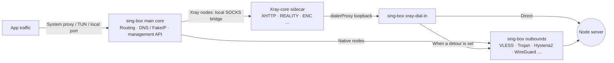

<div align="center">


# FlowZX

A cross-platform proxy client built on sing-box, with a bundled Xray-core for Xray-only protocol combinations

[](https://github.com/mutsuki14/FlowZX/releases/latest)
[](https://github.com/mutsuki14/FlowZX/releases)
[](https://github.com/mutsuki14/FlowZX/actions/workflows/ci.yml)
[](https://github.com/SagerNet/sing-box)
[](https://github.com/XTLS/Xray-core)
[](#download)
[](LICENSE.txt)

[简体中文](README.md) · **English** · [繁體中文](README.zh-TW.md) · [Русский](README.ru.md) · [فارسی](README.fa.md)

<sub>This English README is translated from the Simplified Chinese version; if the two differ, the Simplified Chinese version prevails.</sub>

[Download](#download) · [Quick start](#quick-start) · [Protocols](#protocols) · [Features](#features) · [Screenshots](#screenshots) · [How it works](#architecture) · [FAQ](#faq) · [Feedback](#feedback) · [Build](#build) · [Docs](#docs)

</div>

FlowZX is a fork of the cross-platform proxy client [FlowZ](https://github.com/dododook/FlowZ). It is based on FlowZ 4.3.3 and ships [Xray-core](https://github.com/XTLS/Xray-core) 26.3.27 inside the installer. sing-box remains the main core and handles TUN / system proxy, routing, DNS and the management API; Xray runs as a sidecar only for protocol combinations sing-box doesn't support, such as VLESS + XHTTP + REALITY + VLESS Encryption. All other nodes still run on sing-box and behave exactly as they do in FlowZ.

> [!NOTE]
> The installed app is still named **FlowZ**: installers are named `FlowZ-<version>-…`, and on macOS the app is `FlowZ.app`. FlowZX uses the same app ID, install location and config directory as upstream FlowZ, so the two cannot coexist. If FlowZ is already installed, just install FlowZX over it — your nodes, subscriptions and rules are kept. Installing an upstream build over FlowZX, on the other hand, removes the Xray core.

## Highlights

- **Xray-only combinations**: XHTTP (auto / packet-up / stream-up / stream-one, with `extra` support), VLESS Encryption (`mlkem768x25519plus.*`), REALITY ML-DSA-65 (`pqv`), `xtls-rprx-vision-udp443`, certificate SHA-256 pinning (`pcs`), and arbitrary custom Xray outbound JSON.
- **Automatic core selection**: FlowZX decides from a node's parameters whether it needs Xray, hands it to Xray automatically when it does, and marks the node with an **Xray** badge. Xray nodes also support hot switching, rule-targeted nodes, latency tests and proxy chains.
- **Authorize once**: a launchd helper on macOS, a system service on Windows and a systemd helper on Linux. Install it once, and starting or stopping TUN no longer asks for administrator rights every time.
- **Fewer restarts**: switching nodes and changing a rule's target node hot-switch over gRPC; for rules with only domain / IP / port / process conditions, editing the match values hot-reloads a local rule set.
- **Mesh nodes**: WireGuard, Cloudflare WARP (one-click anonymous registration) and Tailscale (browser login, Headscale supported) can be selected and routed just like regular nodes.
- **Leak protection & anti-censorship**: FakeIP, system DNS takeover in TUN mode, Block QUIC, WebRTC leak protection, TLS Fragment, ECH, Shadow-TLS, Hysteria2 port hopping.

<a id="download"></a>

## Download & install

Download the latest version from [Releases](https://github.com/mutsuki14/FlowZX/releases/latest). Direct download links for v4.4.1:

| Platform | File | Notes |
|---|---|---|
| Windows x64 | [FlowZ-4.4.1-win-x64-setup.exe](https://github.com/mutsuki14/FlowZX/releases/download/v4.4.1/FlowZ-4.4.1-win-x64-setup.exe) | Installer; installs for the current user only by default (can be changed to all users during setup), with a choice of directory |
| Windows x64 | [FlowZ-4.4.1-win-x64-portable.exe](https://github.com/mutsuki14/FlowZX/releases/download/v4.4.1/FlowZ-4.4.1-win-x64-portable.exe) | Portable; data is stored in `data\` next to the exe |
| macOS | [FlowZ-4.4.1-mac-arm64.dmg](https://github.com/mutsuki14/FlowZX/releases/download/v4.4.1/FlowZ-4.4.1-mac-arm64.dmg) | Apple silicon (M series) |
| macOS | [FlowZ-4.4.1-mac-x64.dmg](https://github.com/mutsuki14/FlowZX/releases/download/v4.4.1/FlowZ-4.4.1-mac-x64.dmg) | Intel |
| Linux x86_64 | [FlowZ-4.4.1-linux-x86_64.AppImage](https://github.com/mutsuki14/FlowZX/releases/download/v4.4.1/FlowZ-4.4.1-linux-x86_64.AppImage) | No installation needed; requires FUSE 2 |
| Linux x86_64 | [FlowZ-4.4.1-linux-amd64.deb](https://github.com/mutsuki14/FlowZX/releases/download/v4.4.1/FlowZ-4.4.1-linux-amd64.deb) | Debian / Ubuntu; installs to `/opt/FlowZ`; installing `policykit-1` as well is recommended |

| Platform | System requirements |
|---|---|
| Windows | Windows 10 / 11, x64 only |
| macOS | macOS 12 Monterey or later, Apple silicon or Intel |
| Linux | x86_64 only; TUN requires polkit (`pkexec`), plus `setcap` (`libcap2-bin`) when the privileged helper isn't installed; automatic system proxy configuration supports GNOME only — on other desktops, use **TUN** or **Local Only** |

### First launch

- **macOS**: the app isn't signed with an Apple Developer ID, so on first launch macOS says it "is damaged and can't be opened". After dragging FlowZ into **Applications**, run the command below once in Terminal, then open the app normally. Right-click → **Open** does not get past this message. The `0 首次打开必读 READ ME FIRST.txt` file in the DMG contains the same instructions.

  ```bash
  xattr -cr /Applications/FlowZ.app
  ```

- **Windows**: the installer is unsigned, so SmartScreen may show "Windows protected your PC". Click **More info** → **Run anyway**.
- **Linux**: make the AppImage executable with `chmod +x` first; it requires FUSE 2 (e.g. `libfuse2`, or `libfuse2t64` on Ubuntu 24.04). On Ubuntu 24.04 and later the `.deb` is recommended, as its install script writes an AppArmor profile.

### Uninstalling & updating

- Uninstalling the Windows installer version deletes `%APPDATA%\flowz` (all configuration: nodes, subscriptions, rules and so on) and the privileged service. To keep your data, export a backup first under **Settings → Advanced → Data Backup & Restore**. Upgrading in place does not delete data.

> [!IMPORTANT]
> Starting with 4.4.1, **Check for Updates** on the **About** page and in the tray menu, the automatic check at startup, and the repository link and **Report an issue** on the **About** page all point to this repository. In 4.4.0 they still point to upstream [dododook/FlowZ](https://github.com/dododook/FlowZ), so install 4.4.1 manually once from this repository's [Releases](https://github.com/mutsuki14/FlowZX/releases); after that you can update in-app. Upstream installers don't include the Xray core, so don't install them over FlowZX.

<a id="quick-start"></a>

## Quick start

1. **Add nodes**: on the **Nodes** page, click **Add Subscription** and paste a subscription URL; or click **Manual Import** to import share links or Clash, sing-box or Xray configs from a file or pasted text. You can also add nodes one by one by hand.
2. **Select a node**: pick the node you want to use on the **Home** or **Nodes** page.
3. **Check the takeover and routing modes**: new installs default to **System** (system proxy) + **Global**.
   - **Smart**: domestic traffic goes direct, foreign traffic goes through the proxy. Custom rules and App Policy only take effect in this mode.
   - **TUN**: takes over traffic from all apps as well as system DNS. On macOS / Windows you are prompted to install the privileged helper the first time you enable it. On Linux you authorize once via pkexec the first time, or you can install the systemd helper under **Settings → Network → Privileged Helper** so you're never asked again.
   - **Local Only**: only opens a local port (default `7890`, shared by HTTP and SOCKS) and leaves the system proxy and network adapters untouched.
4. **Start the proxy**: click **Start Proxy** on the **Home** page.
5. **(Optional) Configure rules**: add custom rules on the **Rules** page; on the **App Policy** page, assign Proxy / Direct / Block per app (the master switch is off by default).

<a id="protocols"></a>

## Protocol support

Nodes run on sing-box by default; only nodes that use Xray-only features are handed to Xray. See [docs/XRAY.md](docs/XRAY.md) for parameters and implementation details.

| Protocol / combination | sing-box | Xray |
|---|:---:|:---:|
| **VLESS + XHTTP + REALITY + VLESS Encryption** | — | ✅ Auto |
| VLESS / VMess / Trojan + XHTTP | — | ✅ Auto |
| VLESS Encryption (`mlkem768x25519plus.*`, any transport except HTTP/2) | — | ✅ Auto |
| `xtls-rprx-vision-udp443` flow | — | ✅ Auto |
| REALITY ML-DSA-65 verification (`pqv`) | — | ✅ Auto |
| TLS + certificate SHA-256 pinning (`pcs`) | — | ✅ Auto |
| VLESS / VMess / Trojan (TCP / WebSocket / gRPC / HTTPUpgrade + TLS; VLESS also supports REALITY and `xtls-rprx-vision`) | ✅ Default | Opt-in |
| VLESS / VMess / Trojan + HTTP/2 transport | ✅ | — |
| Shadowsocks / SS2022 (optionally with a plugin or Shadow-TLS v3) | ✅ | Imported combinations such as XHTTP only (auto; no toggle in the form) |
| Hysteria2 (port hopping, salamander / gecko obfuscation), TUIC, AnyTLS, Snell v4 / v6 | ✅ | — |
| NaiveProxy (Cronet, optional HTTP/3) | ✅ | — |
| SOCKS5, HTTP(S), SSH | ✅ | — |
| WireGuard, Cloudflare WARP, Tailscale (mesh nodes) | ✅ | — |
| Custom outbound JSON | ✅ sing-box outbound | ✅ Xray outbound (e.g. mKCP + finalmask, hysteria, wireguard) |

**✅ Auto**: as soon as a node uses the feature it runs on Xray instead; the node card shows an **Xray** badge, and hovering over it shows why. **✅ Default / Opt-in**: runs on sing-box by default; turn on **Run on Xray core** under **Advanced** in the node editor to run it on Xray. **—**: not run by that core.

### Import sources

| Format | Subscription | Manual Import |
|---|:---:|:---:|
| Share links: `vless`, `vmess`, `trojan`, `hysteria2` / `hy2`, `ss`, `tuic`, `anytls`, `snell`, `naive+https`, `socks5`, `http(s)` and more, optionally as a Base64 list | ✅ | ✅ |
| Clash / mihomo YAML or JSON (including `xhttp-opts` and `proxy-providers`) | ✅ | ✅ |
| sing-box JSON (`outbounds`) | ✅ | ✅ |
| Xray JSON config | — | ✅ |

When you import Xray JSON through Manual Import, nodes the form can represent become regular nodes; everything else (e.g. mKCP, finalmask, mux, custom sockopt) is imported as-is as custom Xray outbound JSON.

<a id="features"></a>

## Features

### Takeover & routing

- Takeover modes: System (system proxy) / TUN / Local Only
- Routing modes: Global / Smart / Direct; region routing (China / Iran / Russia, reversible)
- The local mixed port can be shared with the LAN
- One-click copy of terminal proxy commands (CMD / PowerShell / Bash / git)

### Node switching

- Hot switching over gRPC, falling back to a core restart if it fails; by default, connections on the previous node are closed when you switch (can be turned off)
- Edits to nodes that aren't in use are staged as pending changes by default and take effect with one click (**Apply Now**)
- Optional automatic failover (**Auto-Switch Node on Failure**): probes every 30 seconds and switches after 3 consecutive failures
- Proxy chains (detour), with loops excluded automatically

### Rules

- 15 condition types (domain, IP/CIDR, port, process, source MAC / hostname, geosite, geoip, rule set and more), combinable with OR / AND
- Actions: Proxy / Direct / Block, optionally with a specific target node
- Rule Resources: built-in MetaCubeX rule catalog; add remote `https://….srs` rule sets, auto-updated every 12 hours by default
- App Policy: assign Proxy / Direct / Block per process (experimental)

### DNS & leak protection

- Separate domestic / foreign DoH servers (defaults: `doh.pub` / `dns.google`)
- FakeIP (on by default for new installs); system DNS takeover in TUN mode
- Node domains resolved by racing multiple upstreams; browser DoH interception
- Block QUIC (on by default for new installs); WebRTC leak protection (TUN only)

### Anti-censorship

- TLS Fragment: a global switch that also applies to Xray nodes, but not to Hysteria2 / TUIC / NaiveProxy
- ECH, uTLS fingerprints, Shadow-TLS v3, Multiplex (smux / yamux / h2mux)
- Per-platform choice of TLS engine (Go / Schannel / Network.framework)
- TLS spoof (requires elevated privileges; unavailable on ARM64)

### Mesh networking

- WireGuard: userspace by default, with reserved and MTU support
- Cloudflare WARP: one-click anonymous registration; the device is deregistered when the node is deleted
- Tailscale: browser login or authKey, custom control server (Headscale), exit nodes, subnet routes, Tailscale SSH
- Reverse mesh (requires TUN and the privileged helper)

### Subscriptions

- Auto-update every 12 hours by default (configurable from 1 to 168 hours), with exponential backoff on failure
- Updates don't interrupt current connections by default (unless they change a node that's in use; see the [FAQ](#faq))
- Optional updating through the proxy; shows traffic usage and expiry date
- GitHub downloads can go through a gh-proxy mirror (off by default)

### Diagnostics

- Latency test: measures TTFB by requesting `generate_204` by default (the URL is configurable); bandwidth is not tested
- Streaming / AI service unlock detection (ChatGPT, Claude, Gemini, Netflix, Disney+, Spotify)
- Connection list and live logs
- Export a redacted diagnostic report (including Xray status)

### Management

- Native sing-box gRPC management API
- Bundled official sing-box dashboard (on by default for new installs, available while the proxy is running)
- Online sing-box core updates: sha256 verification, pre-launch check, automatic rollback on failure
- Data backup & restore (6 selectable categories); complete uninstall from within the app

### Interface

- 简体中文 / 繁體中文 / English / Русский / فارسی (Persian uses a right-to-left layout), or follow the system language
- Light / Dark / follow system
- Privacy mode (password lock); optional automatic lightweight / privacy mode when idle
- Lives in the macOS menu bar; launch at login, silent start, auto-connect

<a id="screenshots"></a>

## Screenshots

The screenshots use demo data (no real subscriptions or nodes). The UI shown comes from upstream FlowZ, so it doesn't include the Xray badge or the Xray core status.

| Light | Dark |
|:---:|:---:|
|  |  |

<details>
<summary>More screenshots: Nodes, App Policy, Rules, Rule Resources, Connections, Logs, Settings</summary>

| Nodes | App Policy |
|:---:|:---:|
|  |  |

| Rules | Rule Resources |
|:---:|:---:|
|  |  |

| Connections | Logs |
|:---:|:---:|
|  |  |

| Settings |
|:---:|
|  |

</details>

<a id="architecture"></a>

## How it works



- sing-box is the one and only main core. Inside sing-box, an Xray node is just a local SOCKS outbound, so hot switching, rule-targeted nodes, latency tests and exit IP detection go through the same logic as for native nodes.
- Xray runs with normal user privileges and listens only on `127.0.0.1`. Its config is validated with `xray run -test` before launch, and it starts and stops together with the main core. If it exits unexpectedly it is restarted automatically up to 3 times within 60 seconds; beyond that it stays stopped and a notice is shown, while sing-box keeps running unaffected.
- Connections opened by Xray return to sing-box via `dialerProxy`, and sing-box either dials them directly or hands them to the detour node (which can be a native node or another Xray node). If the detour node is unavailable, the connection is refused rather than falling back to direct. Routing-level settings such as Block QUIC and TLS Fragment apply to Xray nodes too.

<a id="faq"></a>

## FAQ & known limitations

### How do I know which core runs a node?

Nodes with an **Xray** badge run on Xray; hover over the badge to see why (e.g. "XHTTP transport", "certificate SHA-256 pin"). Xray's version and status are shown under **Settings → Advanced → Core Management → Xray core (sidecar)**.

### Why does a plain VLESS / Trojan node show the Xray badge?

TLS nodes with **Certificate SHA-256 pin** (`pcs`) filled in automatically run on Xray, because sing-box doesn't support pinning the whole certificate.

### How do I change the Xray version?

Xray has no online updates. Put `xray` (`xray.exe` on Windows) in the `<userData>/xray_core/` directory; when present, it takes precedence over the bundled version. The exact path is shown in the Xray row of **Core Management**. On macOS / Linux, `chmod +x` the file first; otherwise it is ignored and the bundled version is used.

### Connections drop briefly after changing settings?

sing-box can't add or remove outbounds while running, so some changes require a core restart. Restarts are debounced by 1.5 seconds, so a burst of changes results in a single restart; connections usually recover within a few seconds, a little slower with TUN on Windows.

| Change | Result |
|---|---|
| Switching the selected node; changing a rule's target node | Hot switch, no restart (restarts if the target node has pending changes, or is a mesh node that routes its subnets only while selected) |
| Changing the match values of an enabled rule (rule contains only domain, IP/CIDR, port or process conditions) | Local rule set hot reload, no restart |
| Changing a rule that contains geosite, geoip, rule set or source device conditions | Restart |
| Adding, deleting or reordering rules; changing a rule's action | Restart |
| Switching the routing mode; changing the local port or TUN settings | Restart |
| Editing or deleting a node in use (selected node, rule target, node in a detour chain, mesh node); a subscription update that changes or removes such nodes | Restart |
| Adding, editing or deleting nodes not in use (including such changes from subscription updates) | Staged as pending changes, no restart (can be switched to restart immediately in Settings) |

Changing rules in **Global** or **Direct** mode doesn't trigger a restart, because rules only take effect in **Smart** mode.

### Do DNS, QUIC and WebRTC bypass the proxy in system proxy mode?

Yes. The system proxy only affects apps that honor proxy settings, and DNS takeover and WebRTC leak protection only work in TUN mode. Use TUN when you need full takeover. Block QUIC rejects UDP 443 traffic headed for the proxy so that browsers fall back to TCP; nodes that dial over QUIC themselves (Hysteria2 / TUIC / NaiveProxy) are not affected.

<details>
<summary>Full list of known limitations</summary>

**General**

- Tailscale: only one Tailscale node can be added per device, and all accounts share the `100.64.0.0/10` range.
- NaiveProxy: on Linux / Windows it depends on the bundled `libcronet`. If it's missing, naive nodes are skipped, with a notice if the selected node is a naive node. On macOS, Cronet is statically compiled into sing-box.
- `hy2://` share links don't carry port-hopping parameters; when needed, fill them in the form, or import via sing-box JSON or Clash `ports`.
- Multiplex doesn't apply to nodes using the `vision` flow.
- WireGuard / Tailscale mesh nodes can't be used as a detour.
- Remote imports in Rule Resources only accept `.srs` files from `https://` URLs.

**Xray nodes**

- Xray 26 removed `allowInsecure`, so **Allow Insecure** has no effect on Xray nodes. For self-signed certificates, fill in **Certificate SHA-256 pin** instead; you can get the value with `xray tls hash --cert cert.pem`.
- With ECH enabled, an ECHConfigList or a DNS query server must be provided; otherwise the node is invalid.
- Nodes using the HTTP/2 transport, Shadow-TLS or SS plugins can't be switched to Xray.
- sing-box Multiplex is not used; configure XHTTP connection reuse in `extra.xmux`.
- `tag`, `proxySettings` and `sockopt.dialerProxy` in custom Xray JSON are managed by FlowZX; use the node's **Proxy Chain (Detour)** setting for chaining.
- If the bundled Xray is missing, Xray nodes are skipped, with a notice if the selected node is an Xray node.
- Subscription URLs don't support the Xray JSON format; it can only be imported via Manual Import.

</details>

<a id="feedback"></a>

## Reporting issues

Please report issues in this repository's [Issues](https://github.com/mutsuki14/FlowZX/issues). Starting with 4.4.1, **Report an issue** on the in-app **About** page also opens this repository's new-issue page, prefilled with version and system information. Please include:

- App version, operating system and architecture
- sing-box and Xray versions (**Settings → Advanced → Core Management**)
- Takeover mode and routing mode
- Whether the problematic node has the Xray badge, and the reason the badge shows
- The redacted diagnostic report exported from the **Logs** page

If the problem also occurs on nodes without the Xray badge, it may exist in upstream FlowZ as well.

<a id="build"></a>

## Building from source

Requires Node.js 26 (same as CI), Go 1.24 or later (to build the privileged helper; if Go is missing this step is skipped and the package won't include the helper), `bash`, `curl`, `tar` and `unzip` (on Windows, run in an environment that provides these commands, such as Git Bash), plus access to GitHub and `proxy.golang.org`.

```bash
git clone https://github.com/mutsuki14/FlowZX.git
cd FlowZX
npm ci                 # .npmrc uses the npmmirror registry by default
npm run fetch:core     # downloads sing-box and Xray and verifies sha256; binaries aren't committed, so dev mode needs this too
npm run dev            # Vite + Electron dev mode
```

| Command | Purpose |
|---|---|
| `npm run build` | Compile the main and renderer processes |
| `npm run package:win` | Windows installer and portable builds |
| `npm run package:mac` | `FlowZ.app` for macOS arm64 and x64 (DMGs are only produced in CI) |
| `npm run package:linux` | Linux AppImage and deb |
| `npm test` | Unit tests |
| `npm run lint` | ESLint checks |
| `npm run test:core-gate` | Validate generated configs with the bundled sing-box / Xray |
| `npm run test:xray-e2e` | Xray end-to-end tests (Linux / macOS only; run `fetch:core` first) |

- `package:*` runs `build:helper` → `fetch:core` → `test:core-gate` → `fetch:cronet` (Windows / Linux only) → `fetch:dashboard` → `build` → electron-builder in that order, with output in `dist-package/`. Build each platform's package on that platform.
- The `libcronet` needed by NaiveProxy is downloaded by `fetch:cronet` from the Go module proxy; on macOS, Cronet is statically compiled into sing-box, so nothing needs to be downloaded.
- Releasing: push a `v*` tag, or run the Release workflow manually on the `main` branch; release notes are taken from `docs/releases/v<version>.md`.

Tech stack: Electron 42 · React 19 · TypeScript · Vite · Tailwind CSS · Radix UI · electron-builder; cores: sing-box and Xray-core (versions in the badges at the top and in [`src/shared/core-manifest.json`](src/shared/core-manifest.json)); the privileged components are written in Go (macOS launchd helper, Windows service, Linux systemd helper).

<a id="docs"></a>

## Documentation

| Document | Contents |
|---|---|
| [docs/XRAY.md](docs/XRAY.md) | Xray core: supported combinations, architecture, import parameters, caveats, verification |
| [docs/releases/v4.4.1.md](docs/releases/v4.4.1.md) | v4.4.1 release notes |
| [docs/releases/v4.4.0.md](docs/releases/v4.4.0.md) | v4.4.0 release notes |
| [docs/RELEASE.md](docs/RELEASE.md) | Release process |
| [resources/README.md](resources/README.md) | Bundled resources and core binaries |
| [resources/data/README.md](resources/data/README.md) | Built-in rule sets |
| [helper/README.md](helper/README.md) | macOS privileged helper |

<a id="credits"></a>

## Credits

| Project | Role |
|---|---|
| [FlowZ](https://github.com/dododook/FlowZ) (original author's open-source repository: [zhangjh/FlowZ](https://github.com/zhangjh/FlowZ)) | Upstream of FlowZX |
| [sing-box](https://github.com/SagerNet/sing-box) | Main core |
| [Xray-core](https://github.com/XTLS/Xray-core) | Sidecar core |
| [cronet-go](https://github.com/SagerNet/cronet-go) | Cronet for NaiveProxy |
| [sing-box-dashboard](https://github.com/SagerNet/sing-box-dashboard) | Bundled official dashboard |
| [sing-geoip](https://github.com/SagerNet/sing-geoip) · [sing-geosite](https://github.com/SagerNet/sing-geosite) · [meta-rules-dat](https://github.com/MetaCubeX/meta-rules-dat) | Built-in and downloadable rule sets |
| [IBM Plex](https://github.com/IBM/plex) · [Space Grotesk](https://github.com/floriankarsten/space-grotesk) · [country-flag-icons](https://gitlab.com/catamphetamine/country-flag-icons) | UI fonts and flag icons |

<a id="license"></a>

## License & disclaimer

- FlowZX source code is released under the [MIT](LICENSE.txt) license (Copyright (c) 2025 FlowZ Project).
- Bundled third-party programs are subject to their own licenses: sing-box is GPL-3.0-or-later, Xray-core is MPL-2.0, and other components follow the terms declared by their respective upstreams.
- This software is intended for learning and research only. Please comply with your local laws and regulations; you alone are responsible for any consequences of using this software.
