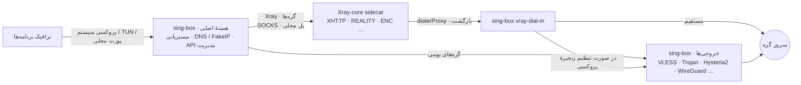

<div align="center" dir="rtl">


# FlowZX

کلاینت پروکسی چندسکویی مبتنی بر sing-box، با Xray-core داخلی برای اجرای ترکیب‌های پروتکلی مختص Xray

[](https://github.com/mutsuki14/FlowZX/releases/latest)
[](https://github.com/mutsuki14/FlowZX/releases)
[](https://github.com/mutsuki14/FlowZX/actions/workflows/ci.yml)
[](https://github.com/SagerNet/sing-box)
[](https://github.com/XTLS/Xray-core)
[](#download)
[](LICENSE.txt)

[简体中文](README.md) · [English](README.en.md) · [繁體中文](README.zh-TW.md) · [Русский](README.ru.md) · **فارسی**

<sub>این راهنمای فارسی از نسخهٔ چینی ساده‌شده ترجمه شده است؛ در صورت هرگونه مغایرت، نسخهٔ چینی ساده‌شده ملاک است.</sub>

[دانلود](#download) · [شروع سریع](#quick-start) · [پروتکل‌ها](#protocols) · [امکانات](#features) · [تصاویر](#screenshots) · [طرز کار](#architecture) · [پرسش‌های متداول](#faq) · [گزارش مشکل](#feedback) · [ساخت](#build) · [مستندات](#docs)

</div>

<div dir="rtl">

پروژهٔ FlowZX انشعابی (fork) از کلاینت پروکسی چندسکویی [FlowZ](https://github.com/dododook/FlowZ) است که بر پایهٔ FlowZ 4.3.3 ساخته شده و [Xray-core](https://github.com/XTLS/Xray-core) 26.3.27 را درون بستهٔ نصب همراه دارد. sing-box همچنان هستهٔ اصلی است و TUN / پروکسی سیستم، مسیریابی، DNS و API مدیریت را بر عهده دارد؛ Xray به‌صورت sidecar (فرایند جانبی) فقط ترکیب‌های پروتکلی‌ای را اجرا می‌کند که sing-box از آن‌ها پشتیبانی نمی‌کند، مانند VLESS + XHTTP + REALITY + VLESS Encryption. بقیهٔ گره‌ها (نودها) مثل قبل با sing-box اجرا می‌شوند و رفتارشان دقیقاً همانند FlowZ است.

> [!NOTE]
> نام برنامه پس از نصب همچنان **FlowZ** است: نام فایل‌های نصب به شکل <code dir="ltr">FlowZ-&lt;نسخه&gt;-…</code> است و در macOS، برنامه با نام `FlowZ.app` دیده می‌شود. FlowZX و FlowZ بالادستی از شناسهٔ برنامه، محل نصب و پوشهٔ پیکربندی یکسانی استفاده می‌کنند و نمی‌توانند هم‌زمان نصب باشند: اگر FlowZ از قبل نصب است، کافی است FlowZX را روی آن نصب کنید؛ گره‌ها، اشتراک‌ها و قوانین حفظ می‌شوند. برعکس، نصب بستهٔ بالادستی روی FlowZX هستهٔ Xray را از بین می‌برد.

## نکات برجسته

- **ترکیب‌های مختص Xray**: XHTTP (حالت‌های auto / packet-up / stream-up / stream-one، با پشتیبانی از `extra`)، VLESS Encryption (<code dir="ltr">mlkem768x25519plus.\*</code>)، REALITY ML-DSA-65 (`pqv`)، `xtls-rprx-vision-udp443`، پین کردن گواهی با SHA-256 (`pcs`) و هر JSON خروجی (outbound) سفارشی Xray.
- **انتخاب خودکار هسته**: برنامه از روی پارامترهای هر گره تشخیص می‌دهد که آیا به Xray نیاز دارد یا نه؛ در صورت نیاز، اجرای گره را خودکار به Xray می‌سپارد و نشان **Xray** را روی آن نمایش می‌دهد. گره‌های Xray هم از تعویض داغ، تعیین به‌عنوان گرهٔ مقصد در قوانین، تست تأخیر و زنجیرهٔ پروکسی پشتیبانی می‌کنند.
- **مجوز یک‌باره**: Helper مبتنی بر launchd در macOS، سرویس سیستمی در Windows و Helper مبتنی بر systemd در Linux؛ پس از یک بار نصب، روشن و خاموش کردن TUN دیگر هر بار دسترسی مدیر (admin) نمی‌خواهد.
- **راه‌اندازی مجدد کمتر**: تعویض گره و تغییر گرهٔ مقصد یک قانون از طریق gRPC به‌صورت داغ انجام می‌شود؛ در قوانینی که فقط شرط دامنه / IP / پورت / فرایند دارند، ویرایش مقادیر تطبیق با بارگذاری مجدد داغ مجموعه‌قانون محلی اعمال می‌شود.
- **گره‌های Mesh**: WireGuard، Cloudflare WARP (ثبت‌نام ناشناس با یک کلیک) و Tailscale (ورود از طریق مرورگر، با پشتیبانی از Headscale) را می‌توان مثل گره‌های معمولی انتخاب کرد و در مسیریابی به کار برد.
- **جلوگیری از نشت و مقابله با سانسور**: FakeIP، تسلط بر DNS سیستم در حالت TUN، مسدودسازی QUIC، حفاظت در برابر نشت WebRTC، تکه‌سازی TLS (TLS Fragment)، ECH، Shadow-TLS و پرش پورت (port hopping) در Hysteria2.

<a id="download"></a>

## دانلود و نصب

آخرین نسخه را از [Releases](https://github.com/mutsuki14/FlowZX/releases/latest) دانلود کنید. جدول زیر لینک‌های مستقیم دانلود نسخهٔ v4.4.0 است:

| سکو | فایل | توضیح |
|---|---|---|
| Windows x64 | [FlowZ-4.4.0-win-x64-setup.exe](https://github.com/mutsuki14/FlowZX/releases/download/v4.4.0/FlowZ-4.4.0-win-x64-setup.exe) | نسخهٔ نصبی؛ به‌طور پیش‌فرض فقط برای کاربر فعلی نصب می‌شود (هنگام نصب می‌توان آن را برای همهٔ کاربران نصب کرد) و پوشهٔ نصب قابل انتخاب است |
| Windows x64 | [FlowZ-4.4.0-win-x64-portable.exe](https://github.com/mutsuki14/FlowZX/releases/download/v4.4.0/FlowZ-4.4.0-win-x64-portable.exe) | نسخهٔ قابل‌حمل؛ داده‌ها در پوشهٔ <code dir="ltr">data&#92;</code> کنار فایل exe ذخیره می‌شوند |
| macOS | [FlowZ-4.4.0-mac-arm64.dmg](https://github.com/mutsuki14/FlowZX/releases/download/v4.4.0/FlowZ-4.4.0-mac-arm64.dmg) | تراشهٔ Apple (سری M) |
| macOS | [FlowZ-4.4.0-mac-x64.dmg](https://github.com/mutsuki14/FlowZX/releases/download/v4.4.0/FlowZ-4.4.0-mac-x64.dmg) | تراشهٔ Intel |
| Linux x86_64 | [FlowZ-4.4.0-linux-x86_64.AppImage](https://github.com/mutsuki14/FlowZX/releases/download/v4.4.0/FlowZ-4.4.0-linux-x86_64.AppImage) | بدون نیاز به نصب؛ به FUSE 2 نیاز دارد |
| Linux x86_64 | [FlowZ-4.4.0-linux-amd64.deb](https://github.com/mutsuki14/FlowZX/releases/download/v4.4.0/FlowZ-4.4.0-linux-amd64.deb) | برای Debian / Ubuntu؛ در <code dir="ltr">/opt/FlowZ</code> نصب می‌شود و نصب هم‌زمان `policykit-1` توصیه می‌شود |

| سکو | پیش‌نیازهای سیستم |
|---|---|
| Windows | Windows 10 / 11، فقط x64 |
| macOS | macOS 12 Monterey و بالاتر، تراشهٔ Apple یا Intel |
| Linux | فقط x86_64؛ حالت TUN به polkit (`pkexec`) نیاز دارد و اگر Helper با دسترسی ویژه نصب نشده باشد، `setcap` (`libcap2-bin`) هم لازم است؛ تنظیم خودکار پروکسی سیستم فقط در GNOME پشتیبانی می‌شود و در سایر میزکارها از TUN یا «فقط محلی» استفاده کنید |

### اجرای نخست

- **در macOS**: برنامه امضای توسعه‌دهندهٔ Apple ندارد، بنابراین در اولین اجرا پیام «آسیب دیده است و باز نمی‌شود» (is damaged and can’t be opened) نمایش داده می‌شود. FlowZ را به پوشهٔ Applications بکشید، سپس یک بار دستور زیر را در Terminal اجرا کنید و بعد برنامه را به‌طور عادی باز کنید. برای این پیام، «کلیک راست ← Open» کارساز نیست. فایل <code dir="ltr">0 首次打开必读 READ ME FIRST.txt</code> داخل DMG هم همین توضیح را دارد.

  <div dir="ltr">

  ```bash
  xattr -cr /Applications/FlowZ.app
  ```

  </div>

- **در Windows**: نصب‌کننده امضا نشده است و SmartScreen ممکن است پیام «Windows protected your PC» را نشان دهد؛ روی «More info» و سپس «Run anyway» کلیک کنید.
- **در Linux**: ابتدا با `chmod +x` فایل AppImage را اجراپذیر کنید؛ AppImage به FUSE 2 نیاز دارد (مثلاً `libfuse2`، و در Ubuntu 24.04 بستهٔ `libfuse2t64`). در Ubuntu 24.04 و بالاتر استفاده از بستهٔ <code dir="ltr">.deb</code> توصیه می‌شود، چون اسکریپت نصب آن پروفایل AppArmor را می‌نویسد.

### حذف و به‌روزرسانی

- نسخهٔ نصبی Windows هنگام حذف نصب، پوشهٔ <code dir="ltr">%APPDATA%\flowz</code> (همهٔ پیکربندی‌ها، از جمله گره‌ها، اشتراک‌ها و قوانین) و سرویس دسترسی ویژه را پاک می‌کند. اگر می‌خواهید داده‌ها حفظ شوند، ابتدا از «تنظیمات ← پیشرفته ← پشتیبان‌گیری و بازیابی داده» یک نسخهٔ پشتیبان بگیرید. ارتقا با نصب روی نسخهٔ قبلی داده‌ها را پاک نمی‌کند.

> [!WARNING]
> گزینهٔ «بررسی به‌روزرسانی‌ها» در صفحهٔ «درباره» و منوی سینی سیستم، بررسی خودکار هنگام راه‌اندازی، و همچنین پیوند مخزن و «گزارش یک مشکل» در صفحهٔ «درباره»، فعلاً هنوز به مخزن بالادستی [dododook/FlowZ](https://github.com/dododook/FlowZ) اشاره می‌کنند؛ دکمهٔ «بررسی به‌روزرسانی‌ها» برای sing-box در «مدیریت هسته» از این موضوع تأثیر نمی‌پذیرد. بسته‌های نصب بالادستی هستهٔ Xray را ندارند و نصب آن‌ها روی FlowZX گره‌های Xray را از کار می‌اندازد. فقط از [Releases](https://github.com/mutsuki14/FlowZX/releases) همین مخزن به‌روزرسانی کنید و توصیه می‌شود در «تنظیمات ← عمومی» گزینهٔ «بررسی به‌روزرسانی‌ها هنگام راه‌اندازی» را خاموش کنید.

<a id="quick-start"></a>

## شروع سریع

1. **افزودن گره**: در صفحهٔ «گره‌ها» روی «افزودن اشتراک» کلیک کنید و لینک اشتراک را بچسبانید؛ یا با «ورود دستی»، لینک‌های اشتراک‌گذاری یا پیکربندی‌های Clash، sing-box و Xray را از فایل یا متن چسبانده‌شده وارد کنید؛ همچنین می‌توانید گره‌ها را یکی‌یکی و به‌صورت دستی اضافه کنید.
2. **انتخاب گره**: در صفحهٔ «خانه» یا «گره‌ها»، گرهٔ مورد نظر را انتخاب کنید.
3. **بررسی روش تسلط و حالت مسیریابی**: در نصب تازه، پیش‌فرض «سیستم» (پروکسی سیستم) + «سراسری» است.
   - «هوشمند»: ترافیک داخلی مستقیم و ترافیک خارجی از طریق پروکسی می‌رود. قوانین سفارشی و «سیاست برنامه‌ها» فقط در این حالت اعمال می‌شوند.
   - «TUN»: ترافیک همهٔ برنامه‌ها و DNS سیستم را در اختیار می‌گیرد. در macOS / Windows هنگام اولین فعال‌سازی، نصب Helper با دسترسی ویژه پیشنهاد می‌شود؛ در Linux هنگام اولین فعال‌سازی یک بار از طریق pkexec مجوز گرفته می‌شود، و می‌توانید Helper مبتنی بر systemd را از «تنظیمات ← شبکه ← Helper با دسترسی ویژه» نصب کنید تا دیگر مجوز خواسته نشود.
   - «فقط محلی»: فقط پورت محلی را باز می‌کند (پیش‌فرض `7890`، مشترک برای HTTP و SOCKS) و به پروکسی سیستم و کارت شبکه دست نمی‌زند.
4. **شروع پروکسی**: در صفحهٔ «خانه» روی «شروع پروکسی» کلیک کنید.
5. **(اختیاری) پیکربندی قوانین**: در صفحهٔ «قوانین» قوانین سفارشی اضافه کنید؛ در صفحهٔ «سیاست برنامه‌ها» برای هر برنامه «پروکسی» / «مستقیم» / «مسدود» را تعیین کنید (کلید اصلی به‌طور پیش‌فرض خاموش است).

<a id="protocols"></a>

## پشتیبانی از پروتکل‌ها

گره‌ها به‌طور پیش‌فرض با sing-box اجرا می‌شوند و فقط گره‌هایی که از قابلیت‌های مختص Xray استفاده می‌کنند به Xray سپرده می‌شوند. پارامترها و جزئیات پیاده‌سازی را در [docs/XRAY.md](docs/XRAY.md) ببینید.

| پروتکل / ترکیب | sing-box | Xray |
|---|:---:|:---:|
| **VLESS + XHTTP + REALITY + VLESS Encryption** | — | ✅ خودکار |
| VLESS / VMess / Trojan + XHTTP | — | ✅ خودکار |
| VLESS Encryption (<code dir="ltr">mlkem768x25519plus.\*</code>، با هر انتقالی به‌جز HTTP/2) | — | ✅ خودکار |
| flow از نوع `xtls-rprx-vision-udp443` | — | ✅ خودکار |
| تأیید REALITY ML-DSA-65 (`pqv`) | — | ✅ خودکار |
| TLS + پین کردن گواهی با SHA-256 (`pcs`) | — | ✅ خودکار |
| VLESS / VMess / Trojan (TCP / WebSocket / gRPC / HTTPUpgrade + TLS؛ VLESS از REALITY و `xtls-rprx-vision` هم پشتیبانی می‌کند) | ✅ پیش‌فرض | قابل تعویض دستی |
| VLESS / VMess / Trojan + انتقال HTTP/2 | ✅ | — |
| Shadowsocks / SS2022 (با امکان افزودن افزونه یا Shadow-TLS v3) | ✅ | فقط ترکیب‌های واردشده‌ای مانند XHTTP (خودکار، بدون کلید در فرم) |
| Hysteria2 (پرش پورت، مبهم‌سازی salamander / gecko)، TUIC، AnyTLS، Snell v4 / v6 | ✅ | — |
| NaiveProxy (Cronet، با HTTP/3 اختیاری) | ✅ | — |
| SOCKS5، HTTP(S)، SSH | ✅ | — |
| WireGuard، Cloudflare WARP، Tailscale (گره‌های Mesh) | ✅ | — |
| JSON خروجی سفارشی | ✅ outbound مربوط به sing-box | ✅ outbound مربوط به Xray (مثلاً mKCP + finalmask، hysteria، wireguard) |

**✅ خودکار**: به محض استفاده از آن قابلیت، گره خودکار با Xray اجرا می‌شود؛ کارت گره نشان **Xray** را نمایش می‌دهد و با بردن نشانگر ماوس روی آن، دلیلش را می‌بینید. **✅ پیش‌فرض / قابل تعویض دستی**: به‌طور پیش‌فرض با sing-box اجرا می‌شود و می‌توانید در بخش «پیشرفته» فرم ویرایش گره، گزینهٔ «اجرا با هسته Xray» را روشن کنید تا با Xray اجرا شود. **—**: با آن هسته اجرا نمی‌شود.

### قالب‌های قابل ورود

| قالب | اشتراک | ورود دستی |
|---|:---:|:---:|
| لینک‌های اشتراک‌گذاری: `vless`، `vmess`، `trojan`، `hysteria2` / `hy2`، `ss`، `tuic`، `anytls`، `snell`، `naive+https`، `socks5`، <code dir="ltr">http(s)</code> و غیره، که می‌توانند به‌صورت فهرست Base64 باشند | ✅ | ✅ |
| Clash / mihomo در قالب YAML یا JSON (شامل `xhttp-opts` و `proxy-providers`) | ✅ | ✅ |
| JSON مربوط به sing-box (`outbounds`) | ✅ | ✅ |
| پیکربندی JSON مربوط به Xray | — | ✅ |

هنگام ورود JSON مربوط به Xray از طریق «ورود دستی»، گره‌هایی که فرم می‌تواند نمایش دهد به گره‌های معمولی تبدیل می‌شوند و بقیه (مانند mKCP، finalmask، mux و sockopt سفارشی) بدون تغییر به‌عنوان «JSON خروجی سفارشی Xray» وارد می‌شوند.

<a id="features"></a>

## امکانات

### تسلط و مسیریابی

- روش تسلط: سیستم (پروکسی سیستم) / TUN / فقط محلی
- حالت مسیریابی: سراسری / هوشمند / مستقیم؛ مسیریابی منطقه‌ای (چین / ایران / روسیه، با امکان معکوس)
- پورت ترکیبی (mixed) محلی را می‌توان در اختیار شبکهٔ محلی (LAN) قرار داد
- کپی دستورهای پروکسی ترمینال با یک کلیک (CMD / PowerShell / Bash / git)

### تعویض گره

- تعویض داغ از طریق gRPC و بازگشت به راه‌اندازی مجدد هسته در صورت شکست؛ به‌طور پیش‌فرض هنگام تعویض، اتصال‌های گرهٔ قبلی قطع می‌شوند («قطع اتصالات موجود هنگام تعویض»، قابل خاموش کردن)
- ویرایش گره‌هایی که در حال استفاده نیستند به‌طور پیش‌فرض «در انتظار اعمال» می‌ماند و با یک کلیک («همین حالا اعمال کن») اعمال می‌شود
- گزینهٔ اختیاری «تعویض خودکار نود هنگام شکست»: هر ۳۰ ثانیه یک بار بررسی می‌کند و پس از ۳ شکست پیاپی، گره را عوض می‌کند
- زنجیرهٔ پروکسی (Detour)، با حذف خودکار حلقه‌ها

### قوانین

- ۱۵ نوع شرط (دامنه، IP/CIDR، پورت، فرایند، MAC / نام میزبانِ مبدأ، geosite، geoip، مجموعه‌قانون و…)، قابل ترکیب با OR / AND
- کنش‌ها: «پروکسی» / «مستقیم» / «مسدود»، با امکان تعیین گرهٔ مقصد
- «منابع قوانین»: کاتالوگ داخلی قوانین MetaCubeX؛ امکان افزودن مجموعه‌قانون راه‌دور `https://….srs`، با به‌روزرسانی خودکار به‌طور پیش‌فرض هر ۱۲ ساعت
- «سیاست برنامه‌ها»: تعیین پروکسی / مستقیم / مسدود برای هر فرایند (آزمایشی)

### مدیریت DNS و جلوگیری از نشت

- تنظیم جداگانهٔ DoH داخلی / خارجی (پیش‌فرض `doh.pub` / `dns.google`)
- FakeIP (در نصب تازه به‌طور پیش‌فرض روشن)؛ تسلط بر DNS سیستم در حالت TUN
- تفکیک نام دامنهٔ گره‌ها با رقابت هم‌زمان چند upstream؛ مسدودسازی DoH مرورگر
- مسدودسازی QUIC (در نصب تازه به‌طور پیش‌فرض روشن)؛ حفاظت در برابر نشت WebRTC (فقط TUN)

### مقابله با سانسور

- تکه‌سازی TLS (TLS Fragment): کلیدی سراسری که روی گره‌های Xray هم اعمال می‌شود، اما روی Hysteria2 / TUIC / NaiveProxy اثری ندارد
- ECH، اثرانگشت uTLS، Shadow-TLS v3، Multiplex (smux / yamux / h2mux)
- موتور TLS قابل انتخاب بسته به سکو (Go / Schannel / Network.framework)
- TLS spoof (نیازمند دسترسی ویژه؛ در ARM64 در دسترس نیست)

### شبکه‌سازی Mesh

- گره WireGuard: به‌طور پیش‌فرض در فضای کاربر (userspace) اجرا می‌شود و از reserved و MTU پشتیبانی می‌کند
- گره Cloudflare WARP: ثبت‌نام ناشناس با یک کلیک؛ با حذف گره، ثبت دستگاه هم لغو می‌شود
- گره Tailscale: ورود از طریق مرورگر یا authKey، سرور کنترل سفارشی (Headscale)، گره خروجی (exit node)، مسیریابی زیرشبکه، Tailscale SSH
- حالت Mesh معکوس (نیازمند TUN و Helper با دسترسی ویژه)

### اشتراک‌ها

- به‌روزرسانی خودکار به‌طور پیش‌فرض هر ۱۲ ساعت (قابل تنظیم از ۱ تا ۱۶۸ ساعت)، با عقب‌نشینی نمایی (exponential backoff) پس از شکست
- به‌روزرسانی به‌طور پیش‌فرض اتصال‌های جاری را قطع نمی‌کند (مگر اینکه گرهٔ در حال استفاده را تغییر دهد؛ [پرسش‌های متداول](#faq) را ببینید)
- امکان به‌روزرسانی از طریق پروکسی؛ نمایش حجم ترافیک و تاریخ انقضا
- دانلودهای GitHub می‌توانند از آینهٔ gh-proxy عبور کنند (به‌طور پیش‌فرض خاموش)

### عیب‌یابی

- تست تأخیر: اندازه‌گیری TTFB، به‌طور پیش‌فرض با درخواست به `generate_204` (نشانی قابل تغییر است)؛ پهنای باند اندازه‌گیری نمی‌شود
- «بررسی دسترسی» سرویس‌های استریم و هوش مصنوعی (ChatGPT، Claude، Gemini، Netflix، Disney+، Spotify)
- فهرست اتصال‌ها و لاگ زنده
- خروجی گرفتن گزارش عیب‌یابی پاک‌سازی‌شده (شامل وضعیت Xray)

### مدیریت

- پشتیبانی از API مدیریت بومی gRPC در sing-box
- پنل رسمی sing-box همراه برنامه (در نصب تازه به‌طور پیش‌فرض روشن؛ هنگام اجرای پروکسی در دسترس است)
- به‌روزرسانی آنلاین هستهٔ sing-box: بررسی sha256، پیش‌بررسی هنگام راه‌اندازی، بازگشت (rollback) خودکار در صورت شکست
- «پشتیبان‌گیری و بازیابی داده» (۶ دستهٔ قابل انتخاب)؛ حذف کامل از داخل برنامه

### رابط کاربری

- زبان‌ها: 简体中文 / 繁體中文 / English / Русский / فارسی (فارسی با چیدمان راست‌به‌چپ)، با امکان پیروی از زبان سیستم
- پوسته: روشن / تیره / سیستم
- «حالت حریم خصوصی» (قفل با رمز عبور)؛ ورود خودکار اختیاری به حالت سبک / حریم خصوصی هنگام بیکاری
- ماندن در نوار منوی macOS؛ اجرا هنگام ورود به سیستم، شروع بی‌صدا، اتصال خودکار

<a id="screenshots"></a>

## تصاویر

تصاویر با داده‌های نمایشی (نه اشتراک یا گره واقعی) تهیه شده‌اند و رابط کاربری آن‌ها از FlowZ بالادستی است، بنابراین نشان Xray و وضعیت هستهٔ Xray در آن‌ها دیده نمی‌شود.

| روشن | تیره |
|:---:|:---:|
|  |  |

<details>
<summary>تصاویر بیشتر: گره‌ها، سیاست برنامه‌ها، قوانین، منابع قوانین، اتصالات، لاگ، تنظیمات</summary>

| گره‌ها | سیاست برنامه‌ها |
|:---:|:---:|
|  |  |

| قوانین | منابع قوانین |
|:---:|:---:|
|  |  |

| اتصالات | لاگ |
|:---:|:---:|
|  |  |

| تنظیمات |
|:---:|
|  |

</details>

<a id="architecture"></a>

## طرز کار

</div>



<div dir="rtl">

- تنها هستهٔ اصلی sing-box است. در sing-box، هر گرهٔ Xray فقط یک خروجی SOCKS محلی است؛ بنابراین تعویض داغ، تعیین گرهٔ مقصد در قوانین، تست تأخیر و تشخیص IP خروجی برای آن با همان منطق گره‌های بومی انجام می‌شود.
- فرایند Xray با دسترسی کاربر عادی اجرا می‌شود و فقط روی `127.0.0.1` گوش می‌دهد. پیش از اجرا، پیکربندی آن با `xray run -test` بررسی می‌شود و Xray همراه با هستهٔ اصلی روشن و خاموش می‌شود؛ اگر به‌طور غیرمنتظره بسته شود، ظرف ۶۰ ثانیه حداکثر ۳ بار خودکار دوباره راه‌اندازی می‌شود و پس از آن متوقف می‌ماند و اعلانی نمایش داده می‌شود؛ sing-box از این موضوع تأثیری نمی‌پذیرد.
- اتصال‌هایی که Xray برقرار می‌کند از طریق `dialerProxy` به sing-box برمی‌گردند و sing-box آن‌ها را مستقیم برقرار می‌کند یا به گرهٔ پیشین در زنجیره (detour) می‌سپارد؛ این گره می‌تواند یک گرهٔ بومی یا یک گرهٔ Xray دیگر باشد. اگر گرهٔ پیشین در دسترس نباشد، اتصال رد می‌شود و به اتصال مستقیم تبدیل نمی‌شود. تنظیمات لایهٔ مسیریابی مانند مسدودسازی QUIC و تکه‌سازی TLS روی گره‌های Xray هم اعمال می‌شوند.

<a id="faq"></a>

## پرسش‌های متداول و محدودیت‌های شناخته‌شده

### از کجا بفهمم هر گره با کدام هسته اجرا می‌شود؟

گره‌هایی که نشان **Xray** دارند با Xray اجرا می‌شوند؛ با بردن نشانگر ماوس روی نشان، دلیل آن را می‌بینید (مثلاً «انتقال XHTTP» یا «اثرانگشت SHA-256 گواهی»). نسخه و وضعیت اجرای Xray را در «تنظیمات ← پیشرفته ← مدیریت هسته ← هسته Xray (sidecar)» ببینید.

### چرا گره‌های معمولی VLESS / Trojan هم نشان Xray دارند؟

گره‌های TLS که «اثرانگشت SHA-256 گواهی» (`pcs`) برایشان پر شده باشد خودکار با Xray اجرا می‌شوند، چون sing-box از پین کردن کل گواهی پشتیبانی نمی‌کند.

### چطور نسخهٔ Xray را عوض کنم؟

هستهٔ Xray به‌روزرسانی آنلاین ندارد. فایل `xray` (یا `xray.exe` در Windows) را در پوشهٔ <code dir="ltr">&lt;userData&gt;/xray_core/</code> قرار دهید؛ اگر این فایل وجود داشته باشد، بر نسخهٔ همراه برنامه اولویت دارد. مسیر دقیق در ردیف Xray در «مدیریت هسته» نمایش داده می‌شود. در macOS / Linux ابتدا باید با `chmod +x` آن فایل را اجراپذیر کنید، وگرنه نادیده گرفته می‌شود و همان نسخهٔ همراه برنامه استفاده می‌شود.

### چرا پس از تغییر تنظیمات، اتصال لحظه‌ای قطع می‌شود؟

هستهٔ sing-box نمی‌تواند در حین اجرا خروجی (outbound) اضافه یا حذف کند، بنابراین برخی تغییرات به راه‌اندازی مجدد هسته نیاز دارند. راه‌اندازی مجدد با تأخیر ۱٫۵ ثانیه‌ای (debounce) انجام می‌شود و تغییرات پشت‌سرهم در یک راه‌اندازی مجدد ادغام می‌شوند؛ اتصال معمولاً ظرف چند ثانیه برمی‌گردد و در حالت TUN روی Windows کمی کندتر است.

| تغییر | نتیجه |
|---|---|
| تعویض گرهٔ انتخاب‌شده؛ تغییر گرهٔ مقصد یک قانون | تعویض داغ، بدون راه‌اندازی مجدد (اگر گرهٔ مقصد «در انتظار اعمال» باشد، یا گرهٔ Mesh‌ای باشد که زیرشبکه‌هایش را فقط هنگام انتخاب‌شدن مسیریابی می‌کند، راه‌اندازی مجدد انجام می‌شود) |
| تغییر مقادیر تطبیق یک قانون فعال (قانون فقط شرط‌های دامنه، IP/CIDR، پورت یا فرایند دارد) | بارگذاری مجدد داغ مجموعه‌قانون محلی، بدون راه‌اندازی مجدد |
| تغییر قانونی که شرط geosite، geoip، مجموعه‌قانون یا دستگاه مبدأ دارد | راه‌اندازی مجدد |
| افزودن، حذف یا تغییر ترتیب قوانین؛ تغییر کنش قانون | راه‌اندازی مجدد |
| تعویض حالت مسیریابی؛ تغییر پورت محلی یا تنظیمات TUN | راه‌اندازی مجدد |
| ویرایش یا حذف گرهٔ در حال استفاده (گرهٔ انتخاب‌شده، مقصد قانون، گرهٔ موجود در زنجیرهٔ پروکسی، گرهٔ Mesh)؛ به‌روزرسانی اشتراکی که این گره‌ها را تغییر دهد یا حذف کند | راه‌اندازی مجدد |
| افزودن، ویرایش یا حذف گره‌هایی که در حال استفاده نیستند (از جمله همین تغییرات ناشی از به‌روزرسانی اشتراک) | قرار گرفتن در «در انتظار اعمال»، بدون راه‌اندازی مجدد (در تنظیمات می‌توان آن را به راه‌اندازی مجدد فوری تغییر داد) |

در حالت «سراسری» یا «مستقیم»، تغییر قوانین باعث راه‌اندازی مجدد نمی‌شود، چون قوانین فقط در حالت «هوشمند» اعمال می‌شوند.

### آیا در حالت پروکسی سیستم، DNS، QUIC و WebRTC پروکسی را دور می‌زنند؟

بله. پروکسی سیستم فقط روی برنامه‌هایی اثر دارد که از تنظیمات پروکسی پیروی می‌کنند، و تسلط بر DNS و حفاظت در برابر نشت WebRTC فقط در حالت TUN کار می‌کنند. اگر تسلط کامل لازم دارید از TUN استفاده کنید. «مسدودسازی QUIC» ترافیک UDP 443 به مقصد پروکسی را رد می‌کند تا مرورگر به TCP برگردد؛ گره‌هایی که خودشان روی QUIC برقرار می‌شوند (Hysteria2 / TUIC / NaiveProxy) تحت تأثیر قرار نمی‌گیرند.

<details>
<summary>فهرست کامل محدودیت‌های شناخته‌شده</summary>

**عمومی**

- گره Tailscale: روی هر دستگاه فقط یک گره Tailscale می‌توان افزود و همهٔ حساب‌ها از بازهٔ `100.64.0.0/10` به‌طور مشترک استفاده می‌کنند.
- گره NaiveProxy: در Linux / Windows به `libcronet` همراه برنامه وابسته است؛ اگر موجود نباشد، گره‌های naive نادیده گرفته می‌شوند و اگر گرهٔ انتخاب‌شده دقیقاً یک گرهٔ naive باشد، اعلانی نمایش داده می‌شود. در macOS، کتابخانهٔ Cronet به‌صورت ایستا در sing-box کامپایل شده است.
- لینک‌های اشتراک‌گذاری <code dir="ltr">hy2://</code> پارامترهای پرش پورت را ندارند؛ در صورت نیاز آن‌ها را در فرم وارد کنید، یا گره را از طریق JSON مربوط به sing-box یا `ports` در Clash وارد کنید.
- قابلیت Multiplex روی گره‌هایی که از flow نوع `vision` استفاده می‌کنند اعمال نمی‌شود.
- گره‌های Mesh از نوع WireGuard / Tailscale نمی‌توانند به‌عنوان گرهٔ پیشین در زنجیرهٔ پروکسی استفاده شوند.
- در «منابع قوانین»، ورود از راه دور فقط فایل‌های <code dir="ltr">.srs</code> با نشانی‌ای که با <code dir="ltr">https://</code> شروع می‌شود را می‌پذیرد.

**گره‌های Xray**

- در Xray 26 گزینهٔ `allowInsecure` حذف شده است، بنابراین «اجازهٔ ناامن» روی گره‌های Xray اثری ندارد. برای گواهی خودامضا، «اثرانگشت SHA-256 گواهی» را پر کنید؛ مقدار آن را می‌توانید با `xray tls hash --cert cert.pem` به دست آورید.
- با فعال بودن ECH باید ECHConfigList یا نشانی DNS برای دریافت آن وارد شود؛ در غیر این صورت گره نامعتبر است.
- گره‌هایی که از انتقال HTTP/2، Shadow-TLS یا افزونهٔ SS استفاده می‌کنند، نمی‌توانند به Xray منتقل شوند.
- از Multiplex مربوط به sing-box استفاده نمی‌شود؛ استفادهٔ مجدد از اتصال در XHTTP را در `extra.xmux` پیکربندی کنید.
- فیلدهای `tag`، `proxySettings` و `sockopt.dialerProxy` در JSON سفارشی Xray را FlowZX مدیریت می‌کند؛ برای زنجیره‌سازی از گزینهٔ «زنجیرهٔ پروکسی (Detour)» در گره استفاده کنید.
- اگر Xray همراه برنامه موجود نباشد، گره‌های Xray نادیده گرفته می‌شوند و اگر گرهٔ انتخاب‌شده دقیقاً یک گرهٔ Xray باشد، اعلانی نمایش داده می‌شود.
- لینک‌های اشتراک از قالب JSON مربوط به Xray پشتیبانی نمی‌کنند؛ این قالب فقط از طریق «ورود دستی» وارد می‌شود.

</details>

<a id="feedback"></a>

## گزارش مشکل

لطفاً مشکلات را در [Issues](https://github.com/mutsuki14/FlowZX/issues) همین مخزن گزارش کنید، نه با «گزارش یک مشکل» داخل برنامه (که مخزن بالادستی را باز می‌کند). لطفاً این موارد را هم بفرستید:

- نسخهٔ برنامه، سیستم‌عامل و معماری
- نسخه‌های sing-box و Xray («تنظیمات ← پیشرفته ← مدیریت هسته»)
- روش تسلط و حالت مسیریابی
- اینکه گرهٔ مشکل‌دار نشان Xray دارد یا نه، و دلیلی که نشان نمایش می‌دهد
- گزارش عیب‌یابی پاک‌سازی‌شده‌ای که از صفحهٔ «لاگ» خروجی گرفته‌اید

اگر مشکل روی گره‌های بدون نشان Xray هم رخ می‌دهد، ممکن است در FlowZ بالادستی هم وجود داشته باشد.

<a id="build"></a>

## ساخت از کد منبع

برای ساخت به Node.js 26 (همانند CI)، Go 1.24 یا بالاتر (برای کامپایل Helper با دسترسی ویژه؛ اگر Go نصب نباشد این مرحله رد می‌شود و بستهٔ خروجی Helper نخواهد داشت)، `bash`، `curl`، `tar` و `unzip` نیاز دارید (در Windows، دستورها را در محیطی مانند Git Bash اجرا کنید که این ابزارها را فراهم می‌کند)، و همچنین به GitHub و `proxy.golang.org` دسترسی داشته باشید.

</div>

```bash
git clone https://github.com/mutsuki14/FlowZX.git
cd FlowZX
npm ci
npm run fetch:core
npm run dev
```

<div dir="rtl">

- دستور `npm ci`: فایل <code dir="ltr">.npmrc</code> به‌طور پیش‌فرض از آینهٔ npmmirror استفاده می‌کند.
- دستور `npm run fetch:core`: هسته‌های sing-box و Xray را دانلود و sha256 آن‌ها را بررسی می‌کند؛ فایل‌های باینری در مخزن نیستند، پس در حالت توسعه هم لازم است.
- دستور `npm run dev`: حالت توسعهٔ Vite + Electron.

| دستور | کاربرد |
|---|---|
| `npm run build` | کامپایل پروسهٔ اصلی و پروسهٔ رندرر |
| `npm run package:win` | نسخهٔ نصبی و قابل‌حمل Windows |
| `npm run package:mac` | فایل `FlowZ.app` برای macOS در معماری‌های arm64 و x64 (فایل DMG فقط در CI ساخته می‌شود) |
| `npm run package:linux` | بسته‌های AppImage و deb برای Linux |
| `npm test` | تست‌های واحد |
| `npm run lint` | بررسی با ESLint |
| `npm run test:core-gate` | اعتبارسنجی پیکربندی‌های تولیدشده با sing-box / Xray همراه برنامه |
| `npm run test:xray-e2e` | تست سرتاسری (end-to-end) Xray (فقط Linux / macOS؛ ابتدا `fetch:core` را اجرا کنید) |

- دستور <code dir="ltr">package:\*</code> به ترتیب این مراحل را اجرا می‌کند: `build:helper` → `fetch:core` → `test:core-gate` → `fetch:cronet` → `fetch:dashboard` → `build` → electron-builder (مرحلهٔ `fetch:cronet` فقط در Windows / Linux)؛ خروجی در <code dir="ltr">dist-package/</code> قرار می‌گیرد. بستهٔ هر سکو را روی همان سیستم‌عامل بسازید.
- کتابخانهٔ `libcronet` که NaiveProxy به آن نیاز دارد، با `fetch:cronet` از پروکسی ماژول‌های Go دانلود می‌شود؛ در macOS، کتابخانهٔ Cronet به‌صورت ایستا در sing-box کامپایل شده و نیازی به دانلود نیست.
- انتشار: تگی به شکل <code dir="ltr">v\*</code> را push کنید، یا workflow مربوط به Release را به‌صورت دستی روی شاخهٔ `main` اجرا کنید؛ یادداشت‌های انتشار از <code dir="ltr">docs/releases/v&lt;نسخه&gt;.md</code> خوانده می‌شوند.

پشتهٔ فناوری: Electron 42 · React 19 · TypeScript · Vite · Tailwind CSS · Radix UI · electron-builder؛ هسته‌ها: sing-box و Xray-core (نسخه‌ها در نشان‌های بالای صفحه و در [`src/shared/core-manifest.json`](src/shared/core-manifest.json) آمده‌اند)؛ اجزای دارای دسترسی ویژه با Go نوشته شده‌اند (Helper مبتنی بر launchd در macOS، سرویس Windows، Helper مبتنی بر systemd در Linux).

<a id="docs"></a>

## مستندات

| سند | محتوا |
|---|---|
| [docs/XRAY.md](docs/XRAY.md) | هستهٔ Xray: ترکیب‌های پشتیبانی‌شده، معماری، پارامترهای ورود، نکات و روش راستی‌آزمایی |
| [docs/releases/v4.4.0.md](docs/releases/v4.4.0.md) | یادداشت‌های انتشار v4.4.0 |
| [docs/RELEASE.md](docs/RELEASE.md) | فرایند انتشار (بخشی از آن از پروژهٔ بالادستی به ارث رسیده و هنوز به‌روز نشده است) |
| [resources/README.md](resources/README.md) | منابع همراه بسته و فایل‌های هسته |
| [resources/data/README.md](resources/data/README.md) | مجموعه‌قوانین داخلی |
| [helper/README.md](helper/README.md) | Helper با دسترسی ویژه در macOS |

<a id="credits"></a>

## سپاسگزاری

| پروژه | کاربرد |
|---|---|
| [FlowZ](https://github.com/dododook/FlowZ) (مخزن متن‌باز نویسندهٔ اصلی: [zhangjh/FlowZ](https://github.com/zhangjh/FlowZ)) | پروژهٔ بالادستی FlowZX |
| [sing-box](https://github.com/SagerNet/sing-box) | هستهٔ اصلی |
| [Xray-core](https://github.com/XTLS/Xray-core) | هستهٔ sidecar |
| [cronet-go](https://github.com/SagerNet/cronet-go) | کتابخانهٔ Cronet برای NaiveProxy |
| [sing-box-dashboard](https://github.com/SagerNet/sing-box-dashboard) | پنل رسمی همراه برنامه |
| [sing-geoip](https://github.com/SagerNet/sing-geoip) · [sing-geosite](https://github.com/SagerNet/sing-geosite) · [meta-rules-dat](https://github.com/MetaCubeX/meta-rules-dat) | مجموعه‌قوانین داخلی و قابل دانلود |
| [IBM Plex](https://github.com/IBM/plex) · [Space Grotesk](https://github.com/floriankarsten/space-grotesk) · [country-flag-icons](https://gitlab.com/catamphetamine/country-flag-icons) | فونت‌های رابط کاربری و آیکون پرچم‌ها |

<a id="license"></a>

## مجوز و سلب مسئولیت

- کد منبع FlowZX تحت مجوز [MIT](LICENSE.txt) منتشر شده است (Copyright (c) 2025 FlowZ Project).
- برنامه‌های شخص ثالثی که همراه بسته توزیع می‌شوند تابع مجوزهای خودشان هستند: sing-box تحت GPL-3.0-or-later، Xray-core تحت MPL-2.0، و سایر اجزا طبق اعلام پروژه‌های بالادستی خود.
- این نرم‌افزار فقط برای یادگیری و پژوهش است. لطفاً قوانین و مقررات محلی را رعایت کنید؛ مسئولیت تمام پیامدهای استفاده از این نرم‌افزار بر عهدهٔ کاربر است.

</div>
