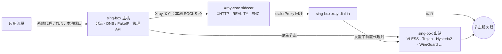

<div align="center">


# FlowZX

基于 sing-box 的跨平台代理客户端，内置 Xray-core 运行 Xray 独有协议组合

[](https://github.com/mutsuki14/FlowZX/releases/latest)
[](https://github.com/mutsuki14/FlowZX/releases)
[](https://github.com/mutsuki14/FlowZX/actions/workflows/ci.yml)
[](https://github.com/SagerNet/sing-box)
[](https://github.com/XTLS/Xray-core)
[](#download)
[](LICENSE.txt)

**简体中文** · [English](README.en.md) · [繁體中文](README.zh-TW.md) · [Русский](README.ru.md) · [فارسی](README.fa.md)

<sub>English / 繁體中文 / Русский / فارسی 版本译自简体中文版，如有出入，以简体中文版为准。</sub>

[下载](#download) · [快速开始](#quick-start) · [协议支持](#protocols) · [功能](#features) · [截图](#screenshots) · [工作原理](#architecture) · [常见问题](#faq) · [反馈](#feedback) · [构建](#build) · [文档](#docs)

</div>

FlowZX 是跨平台代理客户端 [FlowZ](https://github.com/dododook/FlowZ) 的分支，在 FlowZ 4.3.3 的基础上随安装包内置了 [Xray-core](https://github.com/XTLS/Xray-core) 26.3.27。sing-box 仍是主核，负责 TUN / 系统代理、分流、DNS 和管理 API；Xray 以 sidecar 形式只运行 sing-box 不支持的协议组合，例如 VLESS + XHTTP + REALITY + VLESS Encryption。其余节点照常由 sing-box 运行，行为与 FlowZ 相同。

> [!NOTE]
> 安装后的应用名仍是 **FlowZ**：安装包名为 `FlowZ-<版本>-…`，macOS 上是 `FlowZ.app`。FlowZX 与上游 FlowZ 使用相同的应用标识、安装位置和配置目录，两者无法共存：已装 FlowZ 时直接覆盖安装 FlowZX 即可，节点、订阅与规则会保留；反过来用上游安装包覆盖，会失去 Xray 内核。

## 亮点

- **Xray 独有组合**：XHTTP（auto / packet-up / stream-up / stream-one，支持 `extra`）、VLESS Encryption（`mlkem768x25519plus.*`）、REALITY ML-DSA-65（`pqv`）、`xtls-rprx-vision-udp443`、证书 SHA-256 钉扎（`pcs`），以及任意自定义 Xray outbound JSON。
- **自动选择内核**：根据节点参数判断是否需要 Xray，需要时自动交给 Xray 运行，并在节点上显示 **Xray** 角标。Xray 节点同样支持热切换、规则指定节点、测速和代理链。
- **一次授权**：macOS 的 launchd helper、Windows 的系统服务、Linux 的 systemd helper，安装一次后启停 TUN 不再反复请求管理员权限。
- **减少重启**：切换节点、修改规则的目标节点经 gRPC 热切换；只含域名 / IP / 端口 / 进程条件的规则，修改匹配值后经本地规则集热重载。
- **组网节点**：WireGuard、Cloudflare WARP（一键匿名注册）、Tailscale（浏览器登录，支持 Headscale）可以像普通节点一样选中和分流。
- **防泄漏与抗封锁**：FakeIP、TUN 下接管系统 DNS、阻断 QUIC、WebRTC 防护、TLS Fragment、ECH、Shadow-TLS、Hysteria2 端口跳跃。

<a id="download"></a>

## 下载安装

从 [Releases](https://github.com/mutsuki14/FlowZX/releases/latest) 下载最新版本。下表为 v4.4.0 的直接下载链接：

| 平台 | 文件 | 说明 |
|---|---|---|
| Windows x64 | [FlowZ-4.4.0-win-x64-setup.exe](https://github.com/mutsuki14/FlowZX/releases/download/v4.4.0/FlowZ-4.4.0-win-x64-setup.exe) | 安装版，默认仅为当前用户安装（安装时可改为所有用户），可自选目录 |
| Windows x64 | [FlowZ-4.4.0-win-x64-portable.exe](https://github.com/mutsuki14/FlowZX/releases/download/v4.4.0/FlowZ-4.4.0-win-x64-portable.exe) | 便携版，数据保存在 exe 同目录的 `data\` |
| macOS | [FlowZ-4.4.0-mac-arm64.dmg](https://github.com/mutsuki14/FlowZX/releases/download/v4.4.0/FlowZ-4.4.0-mac-arm64.dmg) | Apple 芯片（M 系列） |
| macOS | [FlowZ-4.4.0-mac-x64.dmg](https://github.com/mutsuki14/FlowZX/releases/download/v4.4.0/FlowZ-4.4.0-mac-x64.dmg) | Intel 芯片 |
| Linux x86_64 | [FlowZ-4.4.0-linux-x86_64.AppImage](https://github.com/mutsuki14/FlowZX/releases/download/v4.4.0/FlowZ-4.4.0-linux-x86_64.AppImage) | 免安装，依赖 FUSE 2 |
| Linux x86_64 | [FlowZ-4.4.0-linux-amd64.deb](https://github.com/mutsuki14/FlowZX/releases/download/v4.4.0/FlowZ-4.4.0-linux-amd64.deb) | Debian / Ubuntu，安装到 `/opt/FlowZ`，建议同时安装 `policykit-1` |

| 平台 | 系统要求 |
|---|---|
| Windows | Windows 10 / 11，仅 x64 |
| macOS | macOS 12 Monterey 及以上，Apple 芯片或 Intel |
| Linux | 仅 x86_64；TUN 需要 polkit（`pkexec`），未安装提权助手时还需要 `setcap`（`libcap2-bin`）；自动设置系统代理仅支持 GNOME，其他桌面请用 TUN 或「仅本地」 |

### 首次运行

- **macOS**：应用没有 Apple 开发者签名，首次打开会提示「已损坏，无法打开」。把 FlowZ 拖入「应用程序」后，在终端执行一次下面的命令，再正常打开即可。对这个提示，「右键 → 打开」无效。DMG 中的 `0 首次打开必读 READ ME FIRST.txt` 也有同样说明。

  ```bash
  xattr -cr /Applications/FlowZ.app
  ```

- **Windows**：安装包未签名，SmartScreen 可能提示「Windows 已保护你的电脑」，点「更多信息」→「仍要运行」。
- **Linux**：AppImage 需要先 `chmod +x`，并依赖 FUSE 2（如 `libfuse2`，Ubuntu 24.04 为 `libfuse2t64`）。Ubuntu 24.04 及以上建议用 `.deb`，它的安装脚本会写入 AppArmor 配置。

### 卸载与更新

- Windows 安装版在卸载时会删除 `%APPDATA%\flowz`（节点、订阅、规则等全部配置）和提权服务。需要保留时，请先在「设置 → 高级 → 数据备份与恢复」导出备份。覆盖升级不会删除数据。

> [!WARNING]
> 「关于」页和托盘菜单中的「检查更新」、启动时的自动检查，以及「关于」页的仓库链接与「报告问题」，目前仍指向上游 [dododook/FlowZ](https://github.com/dododook/FlowZ)；「内核管理」中 sing-box 的「检查更新」不受影响。上游安装包不含 Xray 内核，用它覆盖安装后 Xray 节点将无法使用。请只从本仓库 [Releases](https://github.com/mutsuki14/FlowZX/releases) 更新，并建议在「设置 → 常规」关闭「启动时自动检查更新」。

<a id="quick-start"></a>

## 快速开始

1. **添加节点**：在「节点」页点「添加订阅」粘贴订阅链接；或点「手动导入」，从文件或粘贴的文本导入分享链接、Clash、sing-box、Xray 配置；也可以逐个手动添加。
2. **选择节点**：在「主页」或「节点」页选中要使用的节点。
3. **确认接管方式与分流策略**：新安装默认为「系统代理」+「全局」。
   - 「智能分流」：国内直连、国外走代理。自定义规则和应用分流只在这个模式下生效。
   - 「TUN 网卡」：接管所有应用的流量和系统 DNS。macOS / Windows 首次启用时会提示安装提权助手；Linux 首次启用时经 pkexec 授权一次，也可在「设置 → 网络 → 提权助手」安装 systemd 助手，之后不再请求授权。
   - 「仅本地」：只开放本地端口（默认 `7890`，HTTP 和 SOCKS 共用），不改动系统代理和网卡。
4. **开启代理**：在「主页」点「开启代理」。
5. **（可选）配置规则**：在「规则」页添加自定义规则；在「应用分流」页按应用指定代理 / 直连 / 阻断（总开关默认关闭）。

<a id="protocols"></a>

## 协议支持

节点默认由 sing-box 运行，只有用到 Xray 独有特性的节点才交给 Xray。参数和实现细节见 [docs/XRAY.md](docs/XRAY.md)。

| 协议 / 组合 | sing-box | Xray |
|---|:---:|:---:|
| **VLESS + XHTTP + REALITY + VLESS Encryption** | — | ✅ 自动 |
| VLESS / VMess / Trojan + XHTTP | — | ✅ 自动 |
| VLESS Encryption（`mlkem768x25519plus.*`，HTTP/2 以外的传输） | — | ✅ 自动 |
| `xtls-rprx-vision-udp443` 流控 | — | ✅ 自动 |
| REALITY ML-DSA-65 验证（`pqv`） | — | ✅ 自动 |
| TLS + 证书 SHA-256 钉扎（`pcs`） | — | ✅ 自动 |
| VLESS / VMess / Trojan（TCP / WebSocket / gRPC / HTTPUpgrade + TLS；VLESS 另支持 REALITY 与 `xtls-rprx-vision`） | ✅ 默认 | 可手动切换 |
| VLESS / VMess / Trojan + HTTP/2 传输 | ✅ | — |
| Shadowsocks / SS2022（可附加插件或 Shadow-TLS v3） | ✅ | 仅导入的 XHTTP 等组合（自动，表单无开关） |
| Hysteria2（端口跳跃，salamander / gecko 混淆）、TUIC、AnyTLS、Snell v4 / v6 | ✅ | — |
| NaiveProxy（Cronet，可选 HTTP/3） | ✅ | — |
| SOCKS5、HTTP(S)、SSH | ✅ | — |
| WireGuard、Cloudflare WARP、Tailscale（组网节点） | ✅ | — |
| 自定义出站 JSON | ✅ sing-box outbound | ✅ Xray outbound（如 mKCP + finalmask、hysteria、wireguard） |

**✅ 自动**：用到该特性时自动改由 Xray 运行，节点卡片显示 **Xray** 角标，悬停可看原因。**✅ 默认 / 可手动切换**：默认由 sing-box 运行，可在节点编辑表单的「高级」中打开「使用 Xray 内核」改由 Xray 运行。**—**：不由该内核运行。

### 导入来源

| 格式 | 订阅 | 手动导入 |
|---|:---:|:---:|
| 分享链接：`vless`、`vmess`、`trojan`、`hysteria2` / `hy2`、`ss`、`tuic`、`anytls`、`snell`、`naive+https`、`socks5`、`http(s)` 等，可为 Base64 列表 | ✅ | ✅ |
| Clash / mihomo YAML 或 JSON（含 `xhttp-opts`、`proxy-providers`） | ✅ | ✅ |
| sing-box JSON（`outbounds`） | ✅ | ✅ |
| Xray JSON 配置 | — | ✅ |

手动导入 Xray JSON 时，表单能表达的节点转为普通节点，其余（如 mKCP、finalmask、mux、自定义 sockopt）作为「自定义 Xray 出站 JSON」原样导入。

<a id="features"></a>

## 功能

### 接管与分流

- 接管方式：系统代理 / TUN 网卡 / 仅本地
- 分流策略：全局 / 智能分流 / 直连；按地区分流（中国 / 伊朗 / 俄罗斯，可反向）
- 本地混合端口可开放给局域网
- 一键复制终端代理命令（CMD / PowerShell / Bash / git）

### 节点切换

- gRPC 热切换，失败时回退为重启内核；默认切换时断开旧节点上的连接（可关闭）
- 编辑未使用的节点默认进入「待应用」，一键生效
- 可选的故障自动切换：每 30 秒探测，连续 3 次失败后切换
- 代理链（前置代理），自动排除环路

### 规则

- 15 类条件（域名、IP/CIDR、端口、进程、来源 MAC / 主机名、geosite、geoip、规则集等），可 OR / AND 组合
- 动作为代理 / 直连 / 阻断，可指定目标节点
- 规则资源：内置 MetaCubeX 规则目录，可添加 `https://….srs` 远程规则集，默认每 12 小时自动更新
- 应用分流：按进程指定代理 / 直连 / 阻断（实验性）

### DNS 与防泄漏

- 国内 / 国外 DoH 分开设置（默认 `doh.pub` / `dns.google`）
- FakeIP（新安装默认开）；TUN 下接管系统 DNS
- 节点域名多上游竞速解析；拦截浏览器 DoH
- 阻断 QUIC（新安装默认开）；WebRTC 防护（仅 TUN）

### 抗封锁

- TLS Fragment：全局开关，也作用于 Xray 节点，不作用于 Hysteria2 / TUIC / NaiveProxy
- ECH、uTLS 指纹、Shadow-TLS v3、Multiplex（smux / yamux / h2mux）
- 按平台可选的 TLS 引擎（Go / Schannel / Network.framework）
- TLS spoof（需提权，ARM64 不可用）

### 组网

- WireGuard：默认用户态，支持 reserved、MTU
- Cloudflare WARP：一键匿名注册，删除节点时注销设备
- Tailscale：浏览器登录或 authKey、自定义控制服务器（Headscale）、出口节点、子网路由、Tailscale SSH
- 反向 mesh（需 TUN 和提权助手）

### 订阅

- 默认每 12 小时自动更新（可设 1–168 小时），失败后指数退避
- 更新默认不打断当前连接（改动了正在使用的节点时除外，见[常见问题](#faq)）
- 可选经代理更新；显示流量与到期时间
- GitHub 下载可走 gh-proxy 镜像（默认关闭）

### 诊断

- 延迟测速：TTFB，默认请求 `generate_204`，地址可改；不测带宽
- 流媒体 / AI 服务解锁检测（ChatGPT、Claude、Gemini、Netflix、Disney+、Spotify）
- 连接列表与实时日志
- 导出脱敏诊断报告（含 Xray 状态）

### 管理

- sing-box 原生 gRPC 管理 API
- 随包的官方 sing-box 面板（新安装默认开，代理运行时可用）
- sing-box 内核在线更新：sha256 校验、启动预检、失败自动回滚
- 数据备份与恢复（6 类可选）；应用内完整卸载

### 界面

- 简体中文 / 繁體中文 / English / Русский / فارسی（波斯语为从右到左布局），可跟随系统
- 浅色 / 深色 / 跟随系统
- 隐私模式（密码锁）；可选的空闲自动进入轻量 / 隐私模式
- macOS 菜单栏常驻；开机自启、静默启动、自动连接

<a id="screenshots"></a>

## 截图

截图使用演示数据（非真实订阅 / 节点），界面来自上游 FlowZ，未包含 Xray 角标和 Xray 内核状态。

| 浅色 | 深色 |
|:---:|:---:|
|  |  |

<details>
<summary>更多截图：节点、应用分流、规则、规则资源、连接、日志、设置</summary>

| 节点 | 应用分流 |
|:---:|:---:|
|  |  |

| 规则 | 规则资源 |
|:---:|:---:|
|  |  |

| 连接 | 日志 |
|:---:|:---:|
|  |  |

| 设置 |
|:---:|
|  |

</details>

<a id="architecture"></a>

## 工作原理



- sing-box 是唯一的主核。Xray 节点在 sing-box 中只是一个本地 SOCKS 出站，因此热切换、规则指定节点、测速和出口 IP 检测与原生节点走同一套逻辑。
- Xray 以普通用户权限运行，只监听 `127.0.0.1`。启动前用 `xray run -test` 校验配置，随主核启停；意外退出后 60 秒内最多自动重启 3 次，超出后停止并提示，sing-box 不受影响。
- Xray 发出的连接经 `dialerProxy` 回到 sing-box，由 sing-box 直连或交给前置节点（可以是原生节点，也可以是另一个 Xray 节点）。前置节点不可用时连接会被拒绝，不会改为直连。阻断 QUIC、TLS Fragment 等路由层设置对 Xray 节点同样有效。

<a id="faq"></a>

## 常见问题与已知限制

### 怎么知道节点由哪个内核运行？

带 **Xray** 角标的节点由 Xray 运行，悬停可看原因（如「XHTTP 传输」「证书 SHA-256 指纹」）。Xray 的版本和运行状态在「设置 → 高级 → 内核管理 → Xray 内核（sidecar）」中查看。

### 为什么普通的 VLESS / Trojan 节点也显示 Xray 角标？

填写了「证书 SHA-256 指纹」（`pcs`）的 TLS 节点会自动改由 Xray 运行，因为 sing-box 不支持整证书钉扎。

### 怎样更换 Xray 版本？

Xray 没有在线更新。把 `xray`（Windows 为 `xray.exe`）放到 `<userData>/xray_core/` 目录，存在时优先于随包版本；具体路径在内核管理的 Xray 一行中显示。macOS / Linux 需先 `chmod +x` 该文件，否则会被忽略并继续使用随包版本。

### 改了设置后连接短暂中断？

sing-box 不能在运行中增删出站，部分修改需要重启内核。重启有 1.5 秒去抖，连续修改合并为一次，通常几秒内恢复，Windows TUN 下稍慢。

| 修改 | 结果 |
|---|---|
| 切换选中节点；修改规则的目标节点 | 热切换，不重启（目标节点处于「待应用」或为仅在选中时路由内网段的组网节点时会重启） |
| 修改已启用规则的匹配值（规则只含域名、IP/CIDR、端口、进程类条件） | 本地规则集热重载，不重启 |
| 修改含 geosite、geoip、规则集或来源设备条件的规则 | 重启 |
| 新增、删除、排序规则，修改规则动作 | 重启 |
| 切换分流策略，修改本地端口或 TUN 设置 | 重启 |
| 编辑或删除正在使用的节点（选中节点、规则目标、前置代理链中的节点、组网节点）；订阅更新改动或下架了这些节点 | 重启 |
| 增删改未使用的节点（含订阅更新带来的此类变化） | 进入「待应用」，不重启（可在设置中改为立即重启） |

在「全局」或「直连」模式下修改规则不会重启，因为规则只在「智能分流」下生效。

### 系统代理模式下 DNS、QUIC、WebRTC 会绕过代理吗？

会。系统代理只对遵循代理设置的应用生效，DNS 接管和 WebRTC 防护只在 TUN 模式下工作。需要完整接管时请用 TUN。阻断 QUIC 拒绝的是发往代理的 UDP 443，让浏览器回退到 TCP；以 QUIC 拨号的节点（Hysteria2 / TUIC / NaiveProxy）自身不受影响。

<details>
<summary>完整的已知限制</summary>

**通用**

- Tailscale：每台设备只能添加一个 Tailscale 节点，所有账号共用 `100.64.0.0/10` 网段。
- NaiveProxy：Linux / Windows 依赖随包的 `libcronet`，缺失时 naive 节点会被跳过，选中的正是 naive 节点时会提示；macOS 的 sing-box 已静态编入 Cronet。
- `hy2://` 分享链接不携带端口跳跃参数；需要时在表单中填写，或通过 sing-box JSON、Clash `ports` 导入。
- Multiplex 不作用于使用 `vision` 流控的节点。
- WireGuard / Tailscale 组网节点不能作为前置代理。
- 规则资源的远程导入只接受 `https://` 开头的 `.srs` 文件。

**Xray 节点**

- Xray 26 移除了 `allowInsecure`，Xray 节点上的「允许不安全连接」不会生效。自签证书请填写「证书 SHA-256 指纹」，可用 `xray tls hash --cert cert.pem` 获取。
- 开启 ECH 时必须提供 ECHConfigList 或 DNS 查询地址，否则节点无效。
- 使用 HTTP/2 传输、Shadow-TLS 或 SS 插件的节点不能改用 Xray。
- 不使用 sing-box 的 Multiplex；XHTTP 的连接复用请在 `extra.xmux` 中配置。
- 自定义 Xray JSON 中的 `tag`、`proxySettings`、`sockopt.dialerProxy` 由 FlowZX 接管，代理链请用节点的「前置代理」。
- 随包 Xray 缺失时，Xray 节点会被跳过；选中的正是 Xray 节点时会提示。
- 订阅链接不支持 Xray JSON 格式，只能手动导入。

</details>

<a id="feedback"></a>

## 反馈问题

请在本仓库的 [Issues](https://github.com/mutsuki14/FlowZX/issues) 反馈，不要使用应用内的「报告问题」（它会打开上游仓库）。请附上：

- 应用版本、操作系统与架构
- sing-box 与 Xray 版本（设置 → 高级 → 内核管理）
- 接管方式与分流策略
- 出问题的节点是否带 Xray 角标，以及角标显示的原因
- 「日志」页导出的脱敏诊断报告

如果问题在不带 Xray 角标的节点上同样出现，它也可能存在于上游 FlowZ。

<a id="build"></a>

## 从源码构建

需要 Node.js 26（与 CI 一致）、Go 1.24 及以上（编译提权助手；缺少时跳过，打出的包不含提权助手）、`bash`、`curl`、`tar`、`unzip`（Windows 请在 Git Bash 等提供这些命令的环境中执行），并能访问 GitHub 与 `proxy.golang.org`。

```bash
git clone https://github.com/mutsuki14/FlowZX.git
cd FlowZX
npm ci                 # .npmrc 默认使用 npmmirror 镜像
npm run fetch:core     # 下载 sing-box 与 Xray 并校验 sha256；二进制不入库，开发模式同样需要
npm run dev            # Vite + Electron 开发模式
```

| 命令 | 作用 |
|---|---|
| `npm run build` | 编译主进程与渲染进程 |
| `npm run package:win` | Windows 安装版与便携版 |
| `npm run package:mac` | macOS arm64 与 x64 的 `FlowZ.app`（DMG 只在 CI 中生成） |
| `npm run package:linux` | Linux AppImage 与 deb |
| `npm test` | 单元测试 |
| `npm run lint` | ESLint 检查 |
| `npm run test:core-gate` | 用随包的 sing-box / Xray 校验生成的配置 |
| `npm run test:xray-e2e` | Xray 端到端测试（仅 Linux / macOS，需先 `fetch:core`） |

- `package:*` 依次执行 `build:helper` → `fetch:core` → `test:core-gate` → `fetch:cronet`（仅 Windows / Linux）→ `fetch:dashboard` → `build` → electron-builder，产物在 `dist-package/`。各平台请在对应系统上打包。
- NaiveProxy 所需的 `libcronet` 由 `fetch:cronet` 从 Go 模块代理下载；macOS 的 sing-box 已静态编入 Cronet，无需下载。
- 发布：推送 `v*` tag，或在 `main` 分支上手动运行 Release 工作流；发布说明取自 `docs/releases/v<版本>.md`。

技术栈：Electron 42 · React 19 · TypeScript · Vite · Tailwind CSS · Radix UI · electron-builder；内核为 sing-box 与 Xray-core（版本见顶部徽章与 [`src/shared/core-manifest.json`](src/shared/core-manifest.json)）；提权组件用 Go 编写（macOS launchd helper、Windows 服务、Linux systemd helper）。

<a id="docs"></a>

## 文档

| 文档 | 内容 |
|---|---|
| [docs/XRAY.md](docs/XRAY.md) | Xray 内核：支持的组合、架构、导入参数、注意事项、验证方法 |
| [docs/releases/v4.4.0.md](docs/releases/v4.4.0.md) | v4.4.0 发布说明 |
| [docs/RELEASE.md](docs/RELEASE.md) | 发布流程（部分内容沿用上游，尚未更新） |
| [resources/README.md](resources/README.md) | 随包资源与内核文件 |
| [resources/data/README.md](resources/data/README.md) | 内置规则集 |
| [helper/README.md](helper/README.md) | macOS 提权 helper |

<a id="credits"></a>

## 致谢

| 项目 | 用途 |
|---|---|
| [FlowZ](https://github.com/dododook/FlowZ)（原作者开源地址：[zhangjh/FlowZ](https://github.com/zhangjh/FlowZ)） | FlowZX 的上游 |
| [sing-box](https://github.com/SagerNet/sing-box) | 主核 |
| [Xray-core](https://github.com/XTLS/Xray-core) | sidecar 内核 |
| [cronet-go](https://github.com/SagerNet/cronet-go) | NaiveProxy 使用的 Cronet |
| [sing-box-dashboard](https://github.com/SagerNet/sing-box-dashboard) | 随包的官方面板 |
| [sing-geoip](https://github.com/SagerNet/sing-geoip) · [sing-geosite](https://github.com/SagerNet/sing-geosite) · [meta-rules-dat](https://github.com/MetaCubeX/meta-rules-dat) | 内置与可下载的规则集 |
| [IBM Plex](https://github.com/IBM/plex) · [Space Grotesk](https://github.com/floriankarsten/space-grotesk) · [country-flag-icons](https://gitlab.com/catamphetamine/country-flag-icons) | 界面字体与国旗图标 |

<a id="license"></a>

## 许可与免责声明

- FlowZX 源代码以 [MIT](LICENSE.txt) 许可发布（Copyright (c) 2025 FlowZ Project）。
- 随包分发的第三方程序遵循各自的许可：sing-box 为 GPL-3.0-or-later，Xray-core 为 MPL-2.0，其他组件以各自上游的声明为准。
- 本软件仅供学习与研究使用。请遵守当地法律法规，使用本软件产生的一切后果由使用者自行承担。
