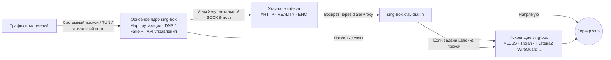

<div align="center">


# FlowZX

Кроссплатформенный прокси-клиент на основе sing-box со встроенным Xray-core для комбинаций протоколов, которые поддерживает только Xray

[](https://github.com/mutsuki14/FlowZX/releases/latest)
[](https://github.com/mutsuki14/FlowZX/releases)
[](https://github.com/mutsuki14/FlowZX/actions/workflows/ci.yml)
[](https://github.com/SagerNet/sing-box)
[](https://github.com/XTLS/Xray-core)
[](#download)
[](LICENSE.txt)

[简体中文](README.md) · [English](README.en.md) · [繁體中文](README.zh-TW.md) · **Русский** · [فارسی](README.fa.md)

<sub>Этот README переведён с версии на упрощённом китайском; при расхождениях ориентируйтесь на версию на упрощённом китайском.</sub>

[Скачать](#download) · [Быстрый старт](#quick-start) · [Протоколы](#protocols) · [Возможности](#features) · [Скриншоты](#screenshots) · [Как это работает](#architecture) · [FAQ](#faq) · [Обратная связь](#feedback) · [Сборка](#build) · [Документация](#docs)

</div>

FlowZX — форк кроссплатформенного прокси-клиента [FlowZ](https://github.com/dododook/FlowZ): он основан на FlowZ 4.3.3, а в установочный пакет дополнительно встроен [Xray-core](https://github.com/XTLS/Xray-core) 26.3.27. Основным ядром остаётся sing-box — он отвечает за TUN / системный прокси, маршрутизацию, DNS и API управления; Xray работает как sidecar и запускает только те комбинации протоколов, которые sing-box не поддерживает, например VLESS + XHTTP + REALITY + VLESS Encryption. Все остальные узлы по-прежнему работают на sing-box и ведут себя так же, как в FlowZ.

> [!NOTE]
> После установки приложение по-прежнему называется **FlowZ**: установочные файлы называются `FlowZ-<версия>-…`, на macOS — `FlowZ.app`. FlowZX использует тот же идентификатор приложения, каталог установки и каталог конфигурации, что и upstream FlowZ, поэтому установить их одновременно нельзя. Если FlowZ уже установлен, просто установите FlowZX поверх — узлы, подписки и правила сохранятся; если же поверх FlowZX установить пакет upstream, ядро Xray пропадёт.

## Главное

- **Комбинации, доступные только в Xray**: XHTTP (auto / packet-up / stream-up / stream-one, с поддержкой `extra`), VLESS Encryption (`mlkem768x25519plus.*`), REALITY ML-DSA-65 (`pqv`), `xtls-rprx-vision-udp443`, закрепление сертификата по SHA-256 (`pcs`), а также любой пользовательский Xray outbound JSON.
- **Автоматический выбор ядра**: по параметрам узла определяется, нужен ли ему Xray; если нужен, узел автоматически запускается на Xray, а на нём появляется бейдж **Xray**. Узлы Xray также поддерживают горячее переключение, назначение узла в правилах, тест задержки и цепочки прокси.
- **Одна авторизация**: launchd helper на macOS, системная служба на Windows, systemd helper на Linux — после однократной установки запуск и остановка TUN больше не запрашивают права администратора.
- **Меньше перезапусков**: смена узла и смена целевого узла правила выполняются горячим переключением через gRPC; если правило содержит только условия по домену / IP / порту / процессу, изменение его значений применяется горячей перезагрузкой локального набора правил.
- **Mesh-узлы**: WireGuard, Cloudflare WARP (анонимная регистрация в один клик) и Tailscale (вход через браузер, поддерживается Headscale) можно выбирать и использовать в маршрутизации как обычные узлы.
- **Защита от утечек и обход блокировок**: FakeIP, перехват системного DNS в режиме TUN, блокировка QUIC, защита от утечек WebRTC, фрагментация TLS, ECH, Shadow-TLS, прыжки по портам (port hopping) Hysteria2.

<a id="download"></a>

## Скачать и установить

Последнюю версию можно скачать на странице [Releases](https://github.com/mutsuki14/FlowZX/releases/latest). Ниже — прямые ссылки на файлы v4.4.0:

| Платформа | Файл | Описание |
|---|---|---|
| Windows x64 | [FlowZ-4.4.0-win-x64-setup.exe](https://github.com/mutsuki14/FlowZX/releases/download/v4.4.0/FlowZ-4.4.0-win-x64-setup.exe) | Установщик: по умолчанию устанавливается только для текущего пользователя (при установке можно выбрать всех пользователей), каталог установки можно выбрать |
| Windows x64 | [FlowZ-4.4.0-win-x64-portable.exe](https://github.com/mutsuki14/FlowZX/releases/download/v4.4.0/FlowZ-4.4.0-win-x64-portable.exe) | Портативная версия, данные хранятся в папке `data\` рядом с exe |
| macOS | [FlowZ-4.4.0-mac-arm64.dmg](https://github.com/mutsuki14/FlowZX/releases/download/v4.4.0/FlowZ-4.4.0-mac-arm64.dmg) | Apple Silicon (чипы серии M) |
| macOS | [FlowZ-4.4.0-mac-x64.dmg](https://github.com/mutsuki14/FlowZX/releases/download/v4.4.0/FlowZ-4.4.0-mac-x64.dmg) | Процессоры Intel |
| Linux x86_64 | [FlowZ-4.4.0-linux-x86_64.AppImage](https://github.com/mutsuki14/FlowZX/releases/download/v4.4.0/FlowZ-4.4.0-linux-x86_64.AppImage) | Без установки, требуется FUSE 2 |
| Linux x86_64 | [FlowZ-4.4.0-linux-amd64.deb](https://github.com/mutsuki14/FlowZX/releases/download/v4.4.0/FlowZ-4.4.0-linux-amd64.deb) | Debian / Ubuntu, устанавливается в `/opt/FlowZ`; рекомендуется также установить `policykit-1` |

| Платформа | Системные требования |
|---|---|
| Windows | Windows 10 / 11, только x64 |
| macOS | macOS 12 Monterey и новее, Apple Silicon или Intel |
| Linux | Только x86_64; для TUN нужен polkit (`pkexec`), а без установленного привилегированного помощника — ещё и `setcap` (`libcap2-bin`); автоматическая настройка системного прокси поддерживается только в GNOME, в других окружениях используйте TUN или «Только локально» |

### Первый запуск

- **macOS**: приложение не подписано сертификатом разработчика Apple, поэтому при первом запуске macOS сообщит, что оно «повреждено и не может быть открыто». Перетащите FlowZ в «Программы», один раз выполните в терминале команду ниже и затем откройте приложение как обычно. «Правый клик → Открыть» в этом случае не помогает. Та же инструкция есть в файле `0 首次打开必读 READ ME FIRST.txt` внутри DMG.

  ```bash
  xattr -cr /Applications/FlowZ.app
  ```

- **Windows**: установщик не подписан, поэтому SmartScreen может показать «Система Windows защитила ваш компьютер» — нажмите «Подробнее» → «Выполнить в любом случае».
- **Linux**: AppImage сначала нужно сделать исполняемым (`chmod +x`); для него требуется FUSE 2 (например, `libfuse2`, в Ubuntu 24.04 — `libfuse2t64`). В Ubuntu 24.04 и новее рекомендуется `.deb`: его установочный скрипт добавляет профиль AppArmor.

### Удаление и обновление

- При удалении установочная версия для Windows стирает `%APPDATA%\flowz` (все настройки: узлы, подписки, правила и т. д.) и привилегированную службу. Если данные нужно сохранить, сначала экспортируйте резервную копию в «Настройки → Дополнительно → Резервное копирование и восстановление данных». Обновление установкой поверх данные не удаляет.

> [!WARNING]
> «Проверить обновления» на странице «О программе» и в меню трея, автоматическая проверка при запуске, а также ссылка на репозиторий и «Сообщить о проблеме» на странице «О программе» пока ведут в upstream-репозиторий [dododook/FlowZ](https://github.com/dododook/FlowZ); на «Проверить обновления» для sing-box в «Управлении ядром» это не распространяется. Пакеты upstream не содержат ядро Xray: после их установки поверх узлы Xray перестанут работать. Обновляйтесь только со страницы [Releases](https://github.com/mutsuki14/FlowZX/releases) этого репозитория; также рекомендуется отключить «Проверять обновления при запуске» в «Настройки → Общие».

<a id="quick-start"></a>

## Быстрый старт

1. **Добавьте узлы**: на странице «Узлы» нажмите «Добавить подписку» и вставьте ссылку на подписку; или нажмите «Ручной импорт», чтобы импортировать ссылки, конфигурации Clash, sing-box или Xray из файла или вставленного текста; узлы можно добавить и вручную по одному.
2. **Выберите узел**: на странице «Главная» или «Узлы» выберите нужный узел.
3. **Проверьте режим перехвата и режим маршрутизации**: после новой установки по умолчанию выбраны «Системный» + «Глобальный».
   - «Умный»: внутренние сайты — напрямую, зарубежные — через прокси. Свои правила и политика приложений действуют только в этом режиме.
   - «TUN»: перехватывает трафик всех приложений и системный DNS. На macOS / Windows при первом включении будет предложено установить привилегированный помощник; на Linux при первом включении нужно один раз авторизоваться через pkexec, либо можно установить systemd-помощник в «Настройки → Сеть → Привилегированный помощник» — после этого авторизация больше не запрашивается.
   - «Только локально»: открывает только локальный порт (по умолчанию `7890`, общий для HTTP и SOCKS) и не меняет системный прокси и сетевые адаптеры.
4. **Запустите прокси**: на странице «Главная» нажмите «Запустить прокси».
5. **(Необязательно) Настройте правила**: добавьте свои правила на странице «Правила»; на странице «Политика приложений» назначьте приложениям «Прокси» / «Прямой» / «Блокировать» (общий переключатель по умолчанию выключен).

<a id="protocols"></a>

## Поддержка протоколов

По умолчанию узлы работают на sing-box; Xray получает только узлы, которые используют возможности, доступные лишь в Xray. Параметры и детали реализации — в [docs/XRAY.md](docs/XRAY.md).

| Протокол / комбинация | sing-box | Xray |
|---|:---:|:---:|
| **VLESS + XHTTP + REALITY + VLESS Encryption** | — | ✅ авто |
| VLESS / VMess / Trojan + XHTTP | — | ✅ авто |
| VLESS Encryption (`mlkem768x25519plus.*`, любые транспорты, кроме HTTP/2) | — | ✅ авто |
| Flow `xtls-rprx-vision-udp443` | — | ✅ авто |
| Проверка REALITY ML-DSA-65 (`pqv`) | — | ✅ авто |
| TLS + закрепление сертификата по SHA-256 (`pcs`) | — | ✅ авто |
| VLESS / VMess / Trojan (TCP / WebSocket / gRPC / HTTPUpgrade + TLS; для VLESS также REALITY и `xtls-rprx-vision`) | ✅ по умолчанию | можно переключить вручную |
| VLESS / VMess / Trojan + транспорт HTTP/2 | ✅ | — |
| Shadowsocks / SS2022 (с плагином или Shadow-TLS v3) | ✅ | только импортированные комбинации вроде XHTTP (автоматически, переключателя в форме нет) |
| Hysteria2 (прыжки по портам, обфускация salamander / gecko), TUIC, AnyTLS, Snell v4 / v6 | ✅ | — |
| NaiveProxy (Cronet, опционально HTTP/3) | ✅ | — |
| SOCKS5, HTTP(S), SSH | ✅ | — |
| WireGuard, Cloudflare WARP, Tailscale (mesh-узлы) | ✅ | — |
| Свой исходящий JSON | ✅ sing-box outbound | ✅ Xray outbound (например, mKCP + finalmask, hysteria, wireguard) |

**✅ авто**: если узел использует такую возможность, он автоматически переходит на Xray, на карточке узла появляется бейдж **Xray**, а при наведении видна причина. **✅ по умолчанию / можно переключить вручную**: по умолчанию узел работает на sing-box; чтобы перевести его на Xray, в форме редактирования узла откройте «Дополнительно» и включите «Использовать ядро Xray». **—**: это ядро такие узлы не запускает.

### Источники импорта

| Формат | Подписка | Ручной импорт |
|---|:---:|:---:|
| Ссылки (share links): `vless`, `vmess`, `trojan`, `hysteria2` / `hy2`, `ss`, `tuic`, `anytls`, `snell`, `naive+https`, `socks5`, `http(s)` и др., в том числе списком в Base64 | ✅ | ✅ |
| Clash / mihomo YAML или JSON (включая `xhttp-opts`, `proxy-providers`) | ✅ | ✅ |
| sing-box JSON (`outbounds`) | ✅ | ✅ |
| Конфигурация Xray в JSON | — | ✅ |

При ручном импорте Xray JSON узлы, которые можно выразить через форму, превращаются в обычные узлы, а остальные (например, mKCP, finalmask, mux, свой sockopt) импортируются без изменений как «пользовательский Xray outbound JSON».

<a id="features"></a>

## Возможности

### Перехват и маршрутизация

- Режимы перехвата: Системный / TUN / Только локально
- Режимы маршрутизации: Глобальный / Умный / Прямой; маршрутизация по регионам (Китай / Иран / Россия, есть обратный режим)
- Локальный смешанный (mixed) порт можно открыть для локальной сети
- Копирование команд настройки прокси для терминала в один клик (CMD / PowerShell / Bash / git)

### Переключение узлов

- Горячее переключение через gRPC, при неудаче — перезапуск ядра; по умолчанию при переключении соединения через старый узел разрываются (можно отключить)
- Изменения неиспользуемых узлов по умолчанию откладываются как ожидающие применения и применяются одной кнопкой
- Опциональное автопереключение узла при сбое: проверка каждые 30 секунд, переключение после 3 неудач подряд
- Цепочки прокси (Detour) с автоматическим исключением петель

### Правила

- 15 типов условий (домен, IP/CIDR, порт, процесс, MAC-адрес / имя хоста источника, geosite, geoip, набор правил и др.), которые можно комбинировать через OR / AND
- Действия: прокси / напрямую / блокировать, можно указать целевой узел
- Ресурсы правил: встроенный каталог правил MetaCubeX, можно добавлять удалённые наборы правил `https://….srs`, по умолчанию они автоматически обновляются каждые 12 часов
- Политика приложений: прокси / напрямую / блокировать для отдельных процессов (экспериментально)

### DNS и защита от утечек

- Отдельные DoH-серверы для внутренних и зарубежных доменов (по умолчанию `doh.pub` / `dns.google`)
- FakeIP (в новых установках включён по умолчанию); перехват системного DNS в режиме TUN
- Разрешение доменов узлов параллельно через несколько DNS-серверов с выбором самого быстрого ответа; перехват DoH браузеров
- Блокировка QUIC (в новых установках включена по умолчанию); защита от утечек WebRTC (только TUN)

### Обход блокировок

- Фрагментация TLS (TLS Fragment): глобальный переключатель, действует и на узлы Xray, но не на Hysteria2 / TUIC / NaiveProxy
- ECH, отпечатки uTLS, Shadow-TLS v3, Multiplex (smux / yamux / h2mux)
- Выбор TLS-движка в зависимости от платформы (Go / Schannel / Network.framework)
- TLS spoof (требует повышенных привилегий, недоступен на ARM64)

### Mesh

- WireGuard: по умолчанию работает в пользовательском пространстве (userspace), поддерживаются reserved и MTU
- Cloudflare WARP: анонимная регистрация в один клик, при удалении узла регистрация устройства отменяется
- Tailscale: вход через браузер или authKey, свой сервер управления (Headscale), выходные узлы, маршрутизация подсетей, Tailscale SSH
- Обратный mesh (нужны TUN и привилегированный помощник)

### Подписки

- По умолчанию автообновление каждые 12 часов (настраивается в пределах 1–168 часов), при ошибках — экспоненциальная задержка
- Обновление по умолчанию не прерывает текущие соединения (кроме случаев, когда меняются используемые узлы, см. [FAQ](#faq))
- Опционально — обновление через прокси; отображаются трафик и срок действия подписки
- Загрузки с GitHub могут идти через зеркало gh-proxy (по умолчанию выключено)

### Диагностика

- Тест задержки: TTFB, по умолчанию запрашивается `generate_204`, адрес можно изменить; пропускная способность не измеряется
- Проверка разблокировки стриминговых и AI-сервисов (ChatGPT, Claude, Gemini, Netflix, Disney+, Spotify)
- Список подключений и журналы в реальном времени
- Экспорт обезличенного диагностического отчёта (включая состояние Xray)

### Управление

- Нативный gRPC API управления sing-box
- Встроенная официальная панель sing-box (в новых установках включена по умолчанию, доступна, когда прокси запущен)
- Онлайн-обновление ядра sing-box: проверка sha256, предварительная проверка при запуске, автоматический откат при сбое
- Резервное копирование и восстановление данных (6 категорий на выбор); полное удаление прямо из приложения

### Интерфейс

- 简体中文 / 繁體中文 / English / Русский / فارسی (персидский — с раскладкой справа налево), можно следовать языку системы
- Светлая / тёмная / системная тема
- Режим конфиденциальности (блокировка паролем); опциональный автоматический переход в облегчённый режим / режим конфиденциальности при бездействии
- Работа из строки меню macOS; запуск при входе в систему, тихий запуск, автоподключение

<a id="screenshots"></a>

## Скриншоты

На скриншотах — демонстрационные данные (не настоящие подписки / узлы); интерфейс взят из upstream FlowZ, поэтому бейджа Xray и состояния ядра Xray на них нет.

| Светлая тема | Тёмная тема |
|:---:|:---:|
|  |  |

<details>
<summary>Ещё скриншоты: узлы, политика приложений, правила, ресурсы правил, подключения, журналы, настройки</summary>

| Узлы | Политика приложений |
|:---:|:---:|
|  |  |

| Правила | Ресурсы правил |
|:---:|:---:|
|  |  |

| Подключения | Журналы |
|:---:|:---:|
|  |  |

| Настройки |
|:---:|
|  |

</details>

<a id="architecture"></a>

## Как это работает



- sing-box — единственное основное ядро. Для sing-box узел Xray — это просто локальный исходящий SOCKS, поэтому горячее переключение, назначение узла в правилах, тест задержки и определение выходного IP работают по той же логике, что и для нативных узлов.
- Xray работает с правами обычного пользователя и слушает только `127.0.0.1`. Перед запуском конфигурация проверяется командой `xray run -test`; Xray запускается и останавливается вместе с основным ядром. При неожиданном завершении он автоматически перезапускается не более 3 раз за 60 секунд, после чего останавливается и показывает уведомление; sing-box при этом продолжает работать.
- Исходящие соединения Xray через `dialerProxy` возвращаются в sing-box, который подключается напрямую или передаёт соединение переднему узлу цепочки (это может быть как нативный узел, так и другой узел Xray). Если передний узел недоступен, соединение отклоняется, а не уходит напрямую. Настройки уровня маршрутизации, такие как блокировка QUIC и фрагментация TLS, действуют и на узлы Xray.

<a id="faq"></a>

## Частые вопросы и известные ограничения

### Как узнать, на каком ядре работает узел?

Узлы с бейджем **Xray** работают на Xray; при наведении видна причина (например, «транспорт XHTTP», «отпечаток сертификата SHA-256»). Версию и состояние Xray можно посмотреть в «Настройки → Дополнительно → Управление ядром → Ядро Xray (sidecar)».

### Почему у обычного узла VLESS / Trojan тоже есть бейдж Xray?

TLS-узлы с заполненным полем «Отпечаток сертификата SHA-256» (`pcs`) автоматически переводятся на Xray, потому что sing-box не поддерживает закрепление сертификата целиком.

### Как сменить версию Xray?

Онлайн-обновления для Xray нет. Положите `xray` (на Windows — `xray.exe`) в каталог `<userData>/xray_core/`: если файл там есть, он используется вместо встроенной версии; точный путь показан в строке Xray в «Управлении ядром». На macOS / Linux сначала выполните для файла `chmod +x`, иначе он будет проигнорирован и продолжит использоваться встроенная версия.

### Соединение ненадолго прерывается после изменения настроек?

sing-box не умеет добавлять и удалять исходящие на лету, поэтому часть изменений требует перезапуска ядра. Перезапуск выполняется с задержкой (debounce) 1,5 секунды, так что несколько изменений подряд объединяются в один перезапуск; обычно связь восстанавливается за несколько секунд, в режиме TUN на Windows — немного дольше.

| Изменение | Результат |
|---|---|
| Смена выбранного узла; смена целевого узла правила | Горячее переключение без перезапуска (перезапуск будет, если у целевого узла есть изменения, ожидающие применения, или это mesh-узел, который маршрутизирует внутренние подсети, только когда выбран) |
| Изменение значений сопоставления включённого правила (правило содержит только условия по домену, IP/CIDR, порту, процессу) | Горячая перезагрузка локального набора правил, без перезапуска |
| Изменение правила, содержащего условия geosite, geoip, набора правил или устройства-источника | Перезапуск |
| Добавление, удаление и изменение порядка правил, смена действия правила | Перезапуск |
| Смена режима маршрутизации, изменение локального порта или настроек TUN | Перезапуск |
| Изменение или удаление используемого узла (выбранного узла, цели правила, узла в цепочке прокси, mesh-узла); обновление подписки изменило или удалило такие узлы | Перезапуск |
| Добавление, удаление и изменение неиспользуемых узлов (в том числе такие изменения из обновления подписки) | Изменения ожидают применения, без перезапуска (в настройках можно включить немедленный перезапуск) |

В режимах «Глобальный» и «Прямой» изменение правил не вызывает перезапуска, потому что правила действуют только в режиме «Умный».

### Обходят ли DNS, QUIC и WebRTC прокси в режиме системного прокси?

Да. Системный прокси действует только на приложения, которые учитывают настройки прокси, а перехват DNS и защита от утечек WebRTC работают только в режиме TUN. Для полного перехвата используйте TUN. Блокировка QUIC отклоняет UDP 443, направленный в прокси, чтобы браузер перешёл на TCP; на узлы, которые сами подключаются по QUIC (Hysteria2 / TUIC / NaiveProxy), это не влияет.

<details>
<summary>Полный список известных ограничений</summary>

**Общие**

- Tailscale: на одном устройстве можно добавить только один узел Tailscale; все аккаунты используют общий диапазон `100.64.0.0/10`.
- NaiveProxy: на Linux / Windows нужна встроенная `libcronet`; если её нет, узлы naive пропускаются, а если выбран именно узел naive, показывается уведомление; на macOS Cronet статически вкомпилирован в sing-box.
- Ссылки `hy2://` не передают параметры прыжков по портам; при необходимости укажите их в форме или импортируйте узел через sing-box JSON или `ports` в Clash.
- Multiplex не применяется к узлам с flow `vision`.
- Mesh-узлы WireGuard / Tailscale нельзя использовать как передний прокси в цепочке.
- Удалённый импорт в «Ресурсах правил» принимает только файлы `.srs` по адресам, начинающимся с `https://`.

**Узлы Xray**

- В Xray 26 удалён `allowInsecure`, поэтому параметр «Разрешить небезопасное» на узлах Xray не действует. Для самоподписанных сертификатов заполните «Отпечаток сертификата SHA-256»; его можно получить командой `xray tls hash --cert cert.pem`.
- При включённом ECH обязательно укажите ECHConfigList или адрес для DNS-запроса, иначе узел будет недействителен.
- Узлы с транспортом HTTP/2, Shadow-TLS или плагином SS нельзя перевести на Xray.
- Multiplex из sing-box не используется; мультиплексирование соединений XHTTP настраивается в `extra.xmux`.
- Поля `tag`, `proxySettings`, `sockopt.dialerProxy` в пользовательском Xray JSON заполняет сам FlowZX; для цепочек прокси используйте поле узла «Цепочка прокси (Detour)».
- Если встроенный Xray отсутствует, узлы Xray пропускаются; если выбран именно узел Xray, показывается уведомление.
- Подписки не поддерживают формат Xray JSON — его можно импортировать только вручную.

</details>

<a id="feedback"></a>

## Сообщить о проблеме

Сообщайте о проблемах в [Issues](https://github.com/mutsuki14/FlowZX/issues) этого репозитория, а не через «Сообщить о проблеме» в приложении (эта кнопка открывает upstream-репозиторий). Приложите:

- версию приложения, ОС и архитектуру;
- версии sing-box и Xray («Настройки → Дополнительно → Управление ядром»);
- режим перехвата и режим маршрутизации;
- есть ли у проблемного узла бейдж Xray и какую причину он показывает;
- обезличенный диагностический отчёт, экспортированный на странице «Журналы».

Если проблема воспроизводится и на узлах без бейджа Xray, возможно, она есть и в upstream FlowZ.

<a id="build"></a>

## Сборка из исходников

Потребуются Node.js 26 (как в CI), Go 1.24 или новее (для сборки привилегированного помощника; без Go этот шаг пропускается и пакет собирается без помощника), а также `bash`, `curl`, `tar`, `unzip` (на Windows выполняйте команды в окружении, где они есть, например в Git Bash) и доступ к GitHub и `proxy.golang.org`.

```bash
git clone https://github.com/mutsuki14/FlowZX.git
cd FlowZX
npm ci                 # .npmrc по умолчанию использует зеркало npmmirror
npm run fetch:core     # скачать sing-box и Xray и проверить sha256; бинарники не хранятся в репозитории, они нужны и в режиме разработки
npm run dev            # режим разработки Vite + Electron
```

| Команда | Назначение |
|---|---|
| `npm run build` | Сборка main- и renderer-процессов |
| `npm run package:win` | Установщик и портативная версия для Windows |
| `npm run package:mac` | `FlowZ.app` для macOS arm64 и x64 (DMG создаётся только в CI) |
| `npm run package:linux` | AppImage и deb для Linux |
| `npm test` | Модульные тесты |
| `npm run lint` | Проверка ESLint |
| `npm run test:core-gate` | Проверка сгенерированных конфигураций встроенными sing-box / Xray |
| `npm run test:xray-e2e` | Сквозные (e2e) тесты Xray (только Linux / macOS, сначала выполните `fetch:core`) |

- `package:*` последовательно выполняет `build:helper` → `fetch:core` → `test:core-gate` → `fetch:cronet` (только Windows / Linux) → `fetch:dashboard` → `build` → electron-builder; результаты сборки появляются в `dist-package/`. Пакет для каждой платформы собирайте в соответствующей ОС.
- `libcronet` для NaiveProxy скачивается командой `fetch:cronet` через прокси модулей Go; на macOS Cronet статически вкомпилирован в sing-box, скачивать его не нужно.
- Релиз: отправьте (push) тег `v*` или вручную запустите workflow Release на ветке `main`; примечания к выпуску берутся из `docs/releases/v<версия>.md`.

Стек: Electron 42 · React 19 · TypeScript · Vite · Tailwind CSS · Radix UI · electron-builder; ядра — sing-box и Xray-core (версии см. в бейджах вверху и в [`src/shared/core-manifest.json`](src/shared/core-manifest.json)); компоненты для повышения привилегий написаны на Go (launchd helper для macOS, служба Windows, systemd helper для Linux).

<a id="docs"></a>

## Документация

| Документ | Содержание |
|---|---|
| [docs/XRAY.md](docs/XRAY.md) | Ядро Xray: поддерживаемые комбинации, архитектура, параметры импорта, особенности, способы проверки |
| [docs/releases/v4.4.0.md](docs/releases/v4.4.0.md) | Примечания к выпуску v4.4.0 |
| [docs/RELEASE.md](docs/RELEASE.md) | Процесс выпуска (часть содержимого унаследована от upstream и ещё не обновлена) |
| [resources/README.md](resources/README.md) | Встроенные ресурсы и файлы ядер |
| [resources/data/README.md](resources/data/README.md) | Встроенные наборы правил |
| [helper/README.md](helper/README.md) | Привилегированный helper для macOS |

<a id="credits"></a>

## Благодарности

| Проект | Назначение |
|---|---|
| [FlowZ](https://github.com/dododook/FlowZ) (исходный open-source репозиторий автора: [zhangjh/FlowZ](https://github.com/zhangjh/FlowZ)) | Upstream-проект для FlowZX |
| [sing-box](https://github.com/SagerNet/sing-box) | Основное ядро |
| [Xray-core](https://github.com/XTLS/Xray-core) | Ядро-sidecar |
| [cronet-go](https://github.com/SagerNet/cronet-go) | Cronet для NaiveProxy |
| [sing-box-dashboard](https://github.com/SagerNet/sing-box-dashboard) | Встроенная официальная панель |
| [sing-geoip](https://github.com/SagerNet/sing-geoip) · [sing-geosite](https://github.com/SagerNet/sing-geosite) · [meta-rules-dat](https://github.com/MetaCubeX/meta-rules-dat) | Встроенные и загружаемые наборы правил |
| [IBM Plex](https://github.com/IBM/plex) · [Space Grotesk](https://github.com/floriankarsten/space-grotesk) · [country-flag-icons](https://gitlab.com/catamphetamine/country-flag-icons) | Шрифты интерфейса и иконки флагов |

<a id="license"></a>

## Лицензия и отказ от ответственности

- Исходный код FlowZX распространяется по лицензии [MIT](LICENSE.txt) (Copyright (c) 2025 FlowZ Project).
- Сторонние программы, поставляемые в комплекте, распространяются по своим лицензиям: sing-box — GPL-3.0-or-later, Xray-core — MPL-2.0; для остальных компонентов действуют условия, указанные в их upstream-проектах.
- Это ПО предназначено только для обучения и исследований. Соблюдайте местное законодательство; всю ответственность за последствия использования программы несёт пользователь.
