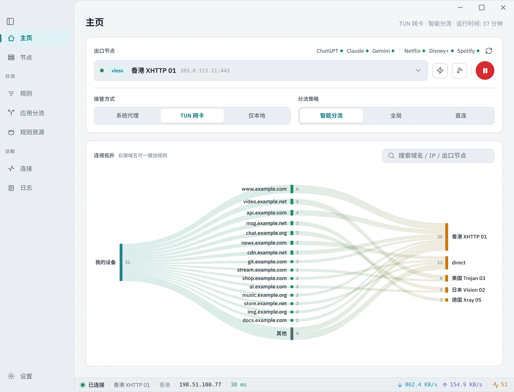
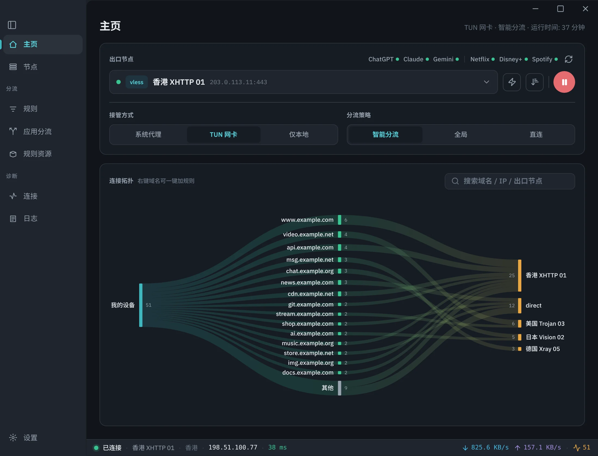
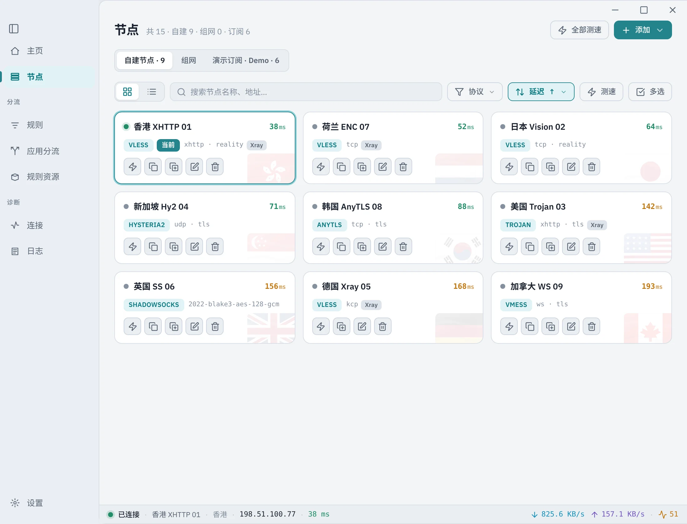
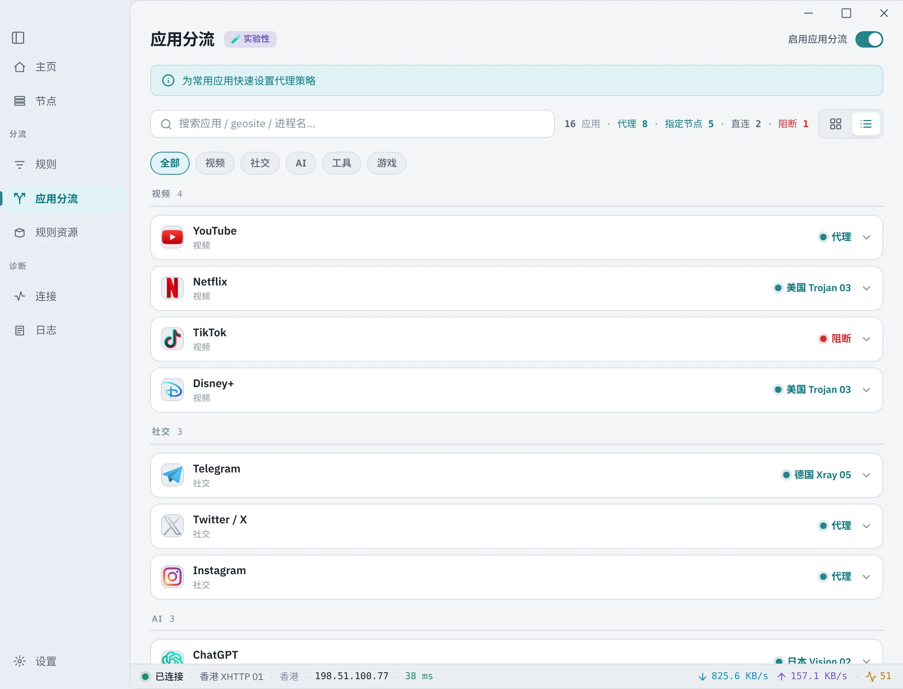
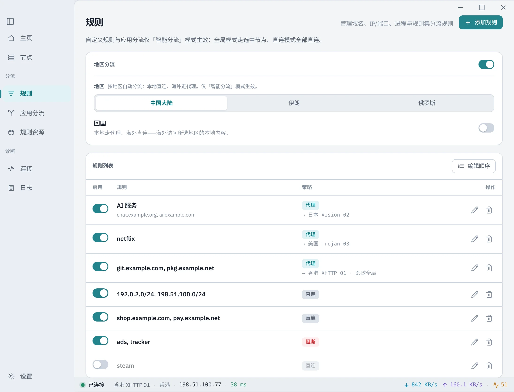
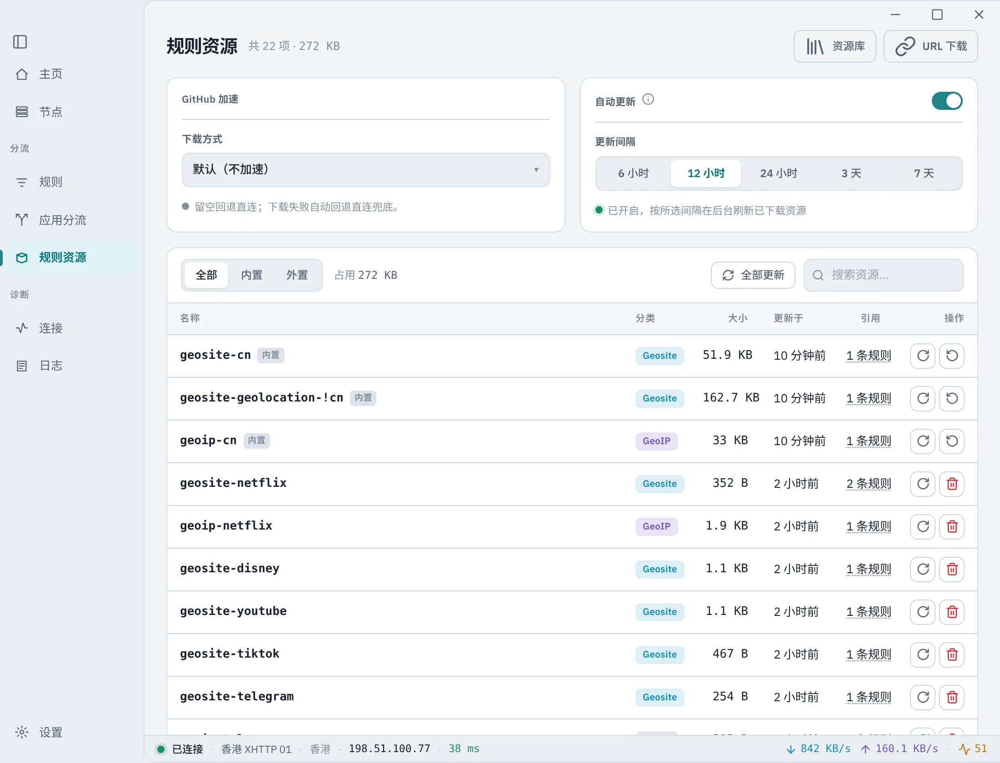
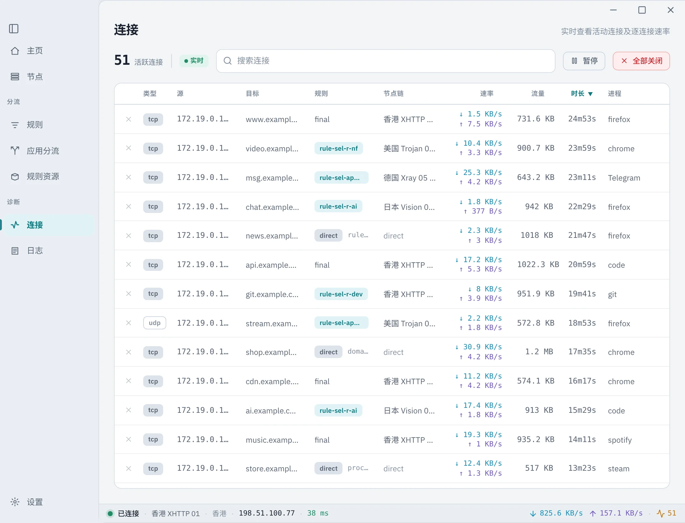
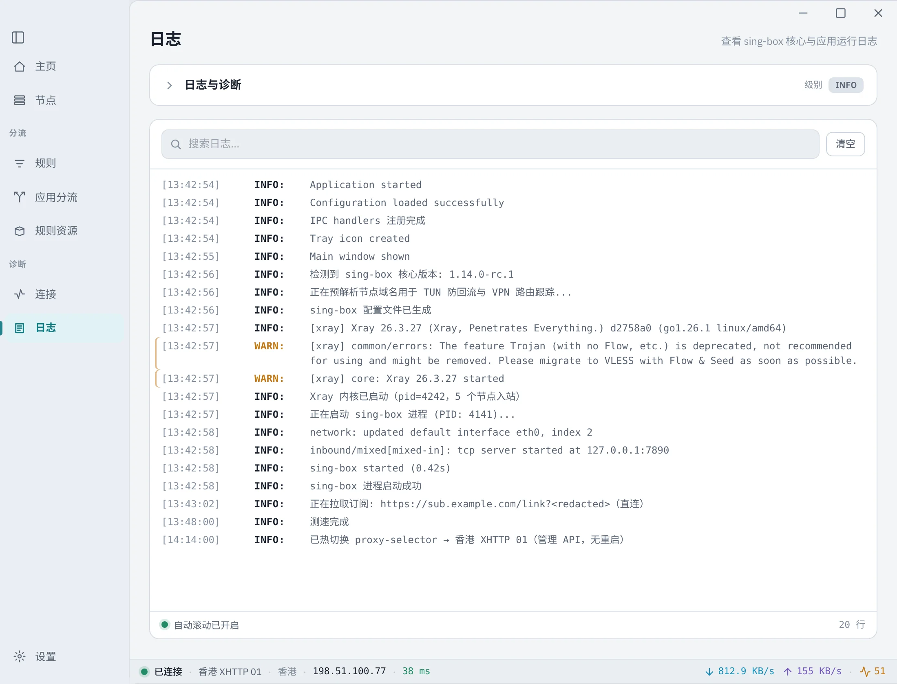
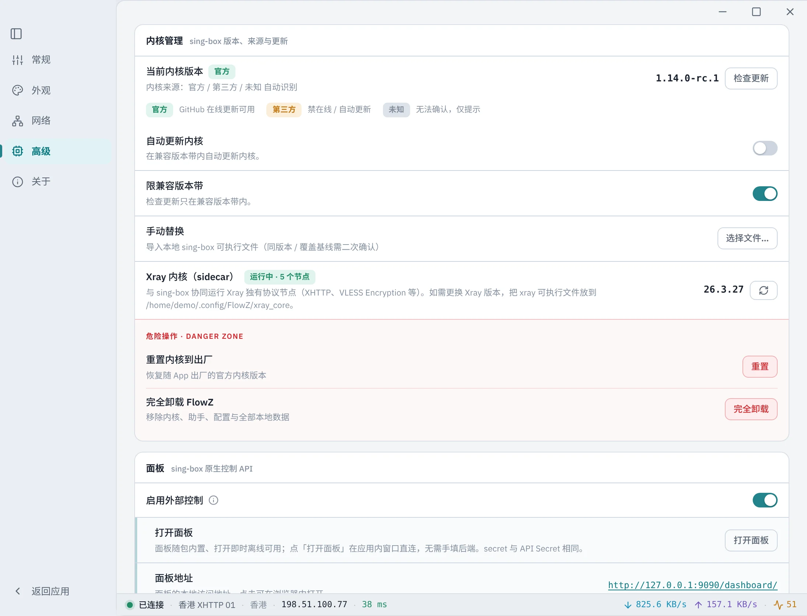

<div align="center">


[](https://github.com/dododook/FlowZ/releases)
[](https://github.com/SagerNet/sing-box)
[](#-安裝)
[](LICENSE.txt)
[](https://github.com/dododook/FlowZ/stargazers)

[简体中文](README.md) · [English](README.en.md) · **繁體中文** · [Русский](README.ru.md) · [فارسی](README.fa.md)

</div>

> 原作者開源網址：https://github.com/zhangjh/FlowZ

主打：**設定簡單 · 規則明確 · 切換不斷流 · 一次授權零提權**。

---

## 🌟 核心亮點

- **一次授權，永久零提權** — macOS root daemon / Windows 系統服務，安裝一次後 TUN 啟停 · 切換節點 · 退出全程免授權。
- **改規則不斷流** — 編輯已啟用規則的比對值，經 local rule-set 熱重載**即時生效、連線零中斷**；只有結構變更才重啟（去抖合併、只重啟一次）。
- **任意協定，核心即權威** — 貼上 sing-box outbound JSON即可使用，儲存時即時探測目前核心的相容性；官方核心不支援的協定可**手動換用第三方 fork 核心**，FlowZ 會自動辨識 fork 並停用線上更新以保護它。
- **組網開箱即用** — WireGuard / **WARP（一鍵匿名註冊）** / **Tailscale（瀏覽器互動登入）** 作為一等節點，可選取 · 分流 · 熱切。
- **退出零殘留** — 跨平台清理 sing-box 程序 / 虛擬網卡 / 系統代理，當機 · 登出 · 關機都有兜底。
- **sing-box 1.14 原生管理面** — 內建 1.14 核心，原生 gRPC 管理 API + 可選官方 dashboard 面板。

---

## ✨ 功能特性

**協定**
- 代理：VLESS / VMess / Trojan / Shadowsocks / **Snell** / Hysteria2 / TUIC / AnyTLS / **NaiveProxy** / SOCKS / HTTP / SSH
- **Xray 核心（FlowZX）**：隨包內建 Xray-core sidecar，支援 **VLESS + XHTTP + REALITY + ENC（VLESS Encryption）**、XHTTP、REALITY ML-DSA-65、vision-udp443 與任意「自訂 Xray outbound JSON」；sing-box 仍為主核。詳見 [docs/XRAY.md](docs/XRAY.md)
- 組網：**WireGuard** / **Cloudflare WARP** / **Tailscale**
- **自訂協定 + 換核擴充**：貼上 sing-box outbound JSON，儲存時以「核心即權威」即時探測相容性；官方核心不支援的協定可手動替換為支援它的第三方 fork 核心（FlowZ 會自動辨識 fork、停用線上更新以防覆蓋）

**核心**
- sing-box 1.14 統一核心，隨套件內建（Windows / macOS arm64+x64 / Linux）
- 抗封鎖增強：**TLS Fragment**（全域）/ ECH / Multiplex / httpupgrade / **Shadow-TLS**（可附加於 SS2022 等協定）/ **Hysteria2 連接埠跳躍**（訂閱自動辨識，部分附手動開關）
- **Block QUIC**（節點無關）：reject 代理向 QUIC/UDP 443，逼瀏覽器回退 TCP，解決節點 UDP relay 不通導致的網頁卡頓
- **WebRTC 防洩漏**（僅 TUN）：off / 走代理 / 阻斷，三檔可選

**代理模式與接管**
- **TUN 透明代理** + **系統代理模式** + 僅本機代理
- 路由模式：全域 / 智慧（自動分流，推薦）/ 直連
- **無縫熱切換節點**：selector 熱切，預設優雅不斷流；可選「切換時中斷現有連線」
- 代理鏈（前置代理）

**組網 / Mesh**
- WireGuard / WARP / Tailscale 作為 endpoint 節點，與一般代理一視同仁（可選取、可分流、可熱切）
- **WARP 一鍵註冊**：匿名註冊裝置即可使用，刪除節點時機會式登出、不留孤兒
- **Tailscale 互動登入**：無需 authKey，點登入走瀏覽器授權，登入態求真、過期自動提示
- **允許存取外網**開關：組網節點既可只通內網、也可當全量出口
- **反向 mesh**（需 TUN + helper）：本機作為子網路由 / 被組網內其他裝置存取

**路由規則**
- **單條規則多條件組合**：網域 / IP / 連接埠 / 程序 / geosite / geoip / 規則集 等 15 類，OR/AND 組合
- **規則資源體系**：內建 geosite/geoip 精選清單 + 遠端 `.srs`/`.json` 規則集下載與定期更新
- **改規則值零重啟**：編輯已啟用規則的比對值（如往網域清單加一條）經 local rule-set 熱重載即時生效、連線不中斷；增刪 / 排序 / 改策略等結構變更才重啟（去抖合併，連改多條只重啟一次）
- **應用分流**：依程序名 / 路徑指定 代理 / 直連 / 阻擋
- 清單搜尋 + 拖曳排序（置頂 / 置底 / 上下移 / 鍵盤無障礙）+ 必填備註名 + 懸浮展開完整規則

**DNS 與分流**
- **FakeIP** 加速 + 依地區分流（境內直連 / 回國反向）
- **DNS 接管**：TUN 模式接管系統 DNS，當機安全兜底
- DoH 上游、節點網域防回流、隱私 DoH 洩漏攔截

**訂閱**
- 訂閱連結匯入（sing-box JSON 與常見分享格式）
- 手動匯入：從檔案或貼上文字（sing-box / Xray / Clash 設定、Base64、分享連結）批次匯入到自建節點；Clash proxy-providers 同時匯入為訂閱（預設不自動更新、直連）
- 自動更新排程（**預設開啟**）：啟動補更陳舊訂閱 + 週期巡檢 + 失敗指數退避 + 「經代理更新」開關，更新**不打斷目前連線**
- 節點穩定指紋對帳：訂閱更新保留本機 id / 選取節點，連線零中斷
- **GitHub 鏡像加速**：核心 / 規則資源 / 面板等 GitHub 下載可走 gh-proxy 鏡像

**介面與體驗**
- **Conduit 設計系統**：token 驅動雙主題（亮 / 暗）+ 自託管字型，視覺統一
- 五種語言：簡體中文 / 繁體中文 / English / Русский / فارسی（含 RTL）
- 連線拓樸 · 即時流量統計與測速 · 出口 IP 顯示
- **隱私保護模式**（密碼鎖，scrypt 雜湊存於獨立檔案、不入設定）
- **自動閒置模式**（系統真實輸入閒置觸發輕量 / 隱私模式）
- **macOS 選單列常駐**：關閉視窗即從 Dock 隱去、僅留選單列，點選單列 / Spotlight 喚回
- 開機自啟 + 自動連線 + 靜默啟動

**管理與診斷**
- **sing-box 1.14 原生 gRPC 管理 API**（取代 clash_api）：狀態 / 連線 / 分組 / 節點熱切統一走原生面
- **官方 sing-box 面板整合**（opt-in 逃生艙）：開關開啟後由核心在 `/dashboard/` serve 官方面板，給進階使用者全功能入口
- **診斷報告匯出**：一鍵蒐集去敏診斷資訊，便於排障

**系統與可靠性**
- **零授權提權鏈**：macOS root daemon · Windows LocalSystem 服務 + 具名管道 / socket · token 鑑權
- **退出零殘留**：跨平台清理程序 / 虛擬網卡 / 系統代理登錄機碼，當機 · 登出 · 關機兜底
- 自動更新：完整性校驗 + 啟動預檢 + 失敗自動回滾 + 問題版本跳過
- 跨平台：Windows / macOS（Apple Silicon + Intel）/ Linux

---

## 🖼 介面預覽

> 截圖為內建 demo 資料，非真實訂閱 / 節點。各語言介面版面一致。

### 首頁 · 連線總覽
所見即所得的連線狀態、節點切換、即時速率與連線拓樸。亮 / 暗雙主題：

| 淺色主題 | 深色主題 |
|:---:|:---:|
|  |  |

### 節點與訂閱
訂閱一鍵匯入、節點卡片管理、協定標識、批次測速與排序：



### 應用分流 · 路由規則
依應用一鍵指定 代理 / 直連 / 阻擋；規則支援多條件組合（網域 / IP / 連接埠 / 程序 / geosite 等 15 類，OR/AND）+ 拖曳排序 + 改值零重啟：

| 應用分流 | 路由規則 |
|:---:|:---:|
|  |  |

### 規則資源
內建 geosite/geoip 精選清單 + 遠端 `.srs` 規則集下載與定期更新：



### 連線診斷 · 即時日誌
逐連線速率 / 規則命中 / 節點鏈；分級即時日誌：

| 連線資訊 | 即時日誌 |
|:---:|:---:|
|  |  |

### 設定 · 一次授權零提權
精細設定；**安裝一次提權 helper / 服務後，TUN 模式啟停免每次授權**（Windows 一次 UAC / macOS 一次密碼）：



---

## ⚠️ 已知限制與行為說明

提 issue 前請先閱讀——以下均為**設計如此，並非 bug**。

### 結構性設定變更會短暫重連（約 1 秒），屬正常
底層 sing-box 核心**沒有執行階段增刪 outbound / 重載整份設定的 API**（其 Clash 相容 API 只能在已載入節點間切換，`PUT /configs` 是空操作）。因此 FlowZ 把變更分為兩類：

- **即時生效、連線零中斷**：
  - 切換選取節點（selector 熱切換）。
  - 編輯已啟用規則的**比對值**（如往網域清單加一條）——經 local rule-set 熱重載。
- **約 1 秒核心重啟**（去抖：連續多次編輯合併為一次；連線短暫中斷後自動恢復）：
  - 增 / 刪 / 排序規則，或改規則的動作 / 目標。
  - 切換路由模式（全域 / 智慧 / 直連）、改本機連接埠或 TUN/inbound 設定。
  - 編輯目前被引用的節點，或訂閱更新引入了**被引用的新節點**。

重啟很快、連線會自動恢復。**改這些設定時出現短暫閃斷請勿提 issue**——這是 sing-box 套用結構性變更的固有方式。

### 其他預期行為
- **Tailscale：每裝置只支援一個節點。** 所有 Tailscale 帳號共用 `100.64.0.0/10`，多個會互相覆蓋。
- **NaiveProxy 依賴 Cronet 函式庫**（Linux/Windows，打包時拉取）。缺失時 naive 節點會被**自動跳過**——其他協定不受影響；若選取的正是 naive 節點會明確提示。
- **系統代理模式無法完整控制 DNS、也擋不住 QUIC 洩漏。** 只有 TUN 模式接管系統 DNS 並能 reject 代理向 QUIC。需要防洩漏的 DNS/QUIC 請用 TUN。
- **Block QUIC 僅作用於代理向 QUIC。** 以 QUIC 撥號的節點（hysteria2 / tuic / naive）自身不受影響——它 reject 的是去往代理的 UDP 443，逼瀏覽器回退 TCP。
- **macOS 提示「軟體已損毀」**（未簽章建置）→ 移除隔離屬性：`xattr -cr /Applications/FlowZ.app`。

---

## 📋 系統需求

| 平台 | 需求 |
|------|------|
| Windows | Windows 10（1809+）/ Windows 11，x64 |
| macOS | macOS 11 (Big Sur)+，Apple Silicon 或 Intel |
| Linux | x86_64，AppImage / `.deb`（TUN 模式需 `pkexec` 一次性授權 setcap） |

---

## 📥 安裝

從 [Releases](https://github.com/dododook/FlowZ/releases) 下載最新版本。

| 平台 | 安裝 |
|------|------|
| **Windows** | 執行 `.exe` 安裝程式，或免安裝 `portable.exe` |
| **macOS** | 開啟 `.dmg` 拖入「應用程式」；arm64 / Intel 均隨發行版提供（Intel 版 naive 開箱即用） |
| **Linux** | `AppImage` 直接執行，或安裝 `.deb` |

macOS 若提示「軟體已損毀」，移除隔離屬性即可：

```bash
xattr -cr /Applications/FlowZ.app
```

---

## 🚀 快速開始

1. **新增節點** —「伺服器」頁選協定填資訊，用「手動匯入」從檔案/文字（sing-box·Xray·Clash·Base64·分享連結）批次匯入，或在「訂閱」匯入訂閱連結。
2. **選模式** — 首頁選路由模式（預設 智慧 / 自動分流）；不用 TUN 可在設定切「系統代理模式」。
3. **啟用代理** — 首頁點「啟用代理」。
4. **（可選）設定規則** —「路由規則」加自訂規則 / 引用規則集；「應用分流」依應用指定策略。

---

## 🛠 從原始碼建置

```bash
git clone https://github.com/dododook/FlowZ.git
cd FlowZ
npm install

npm run dev            # 開發（Vite + Electron 熱重載）
npm run build          # 編譯主程序 + 渲染端

npm run package:win    # Windows 安裝程式 + 可攜版
npm run package:mac    # macOS（arm64 + x64，含交叉編譯 root helper）
npm run package:linux  # Linux（AppImage + deb）
```

- `package:mac` / `package:win` 會先 `build:helper`（Go 交叉編譯提權 helper），再打包。
- NaiveProxy 的 cronet 函式庫由 `npm run fetch:cronet` 在打包時拉取（見下「NaiveProxy 說明」）。

---

## 🛡 進階說明

### 無縫切換節點
預設 **selector 熱切換**：切節點不重啟核心、現有連線保留至自然關閉、新連線走新節點（優雅不斷流）。進階設定「**切換時中斷現有連線**」（預設關）開啟後強制斷開重建。**編輯已啟用規則的比對值**經 local rule-set 熱重載零重啟生效；跨模式 / 連接埠 / TUN / 規則結構（增刪 / 排序 / 改策略）等改動才重啟（多次改動去抖合併、只重啟一次）。

### 組網 / Mesh
WireGuard / WARP / Tailscale 作為 endpoint 節點接入，和一般代理一樣可選取、可被規則指向、可熱切。

- **WARP**：一鍵匿名註冊即可使用；純出口節點，可加多個作備選 / failover（一次啟用一個）。
- **Tailscale**：帳號制，點「登入」走瀏覽器授權（也支援 authKey）；同一裝置**只支援一個 Tailscale 節點**——所有帳號共用 `100.64.0.0/10` 網段，多個會互相覆蓋。
- **允許存取外網**：開 = 當全量出口；關 = 只通組網內網段。
- **反向 mesh**（需 TUN + helper）：建立真核心介面，讓本機可被組網內其他裝置存取 / 作為子網路由；預設關（使用者態只出不進，零提權）。

### Block QUIC（進階設定）
對**代理向 QUIC（UDP 443）**執行 reject、逼瀏覽器回退 TCP，解決「節點 UDP relay 不通導致網頁卡頓 / 斷流」。**節點無關**；hysteria2 / tuic / naive 等以 QUIC 撥號的節點**自身撥號不受影響**。預設關。

### 抗封鎖增強
- **TLS Fragment**（全域開關）：切分 TLS ClientHello，規避基於 SNI 的 DPI 阻斷。對所有 TCP-TLS 節點生效；hysteria2 / tuic / naive 自動排除。
- **ECH / Multiplex / httpupgrade / Hysteria2 連接埠跳躍**：從 **sing-box JSON 訂閱自動辨識並生效**（Multiplex 對 reality+vision 節點自動跳過；連接埠跳躍支援多段範圍）。

### sing-box 官方面板（opt-in）
設定開啟後，核心會在管理 API 監聽埠的 `/dashboard/` 提供官方 sing-box 面板。**僅在代理執行時可用**，與代理模式 / 路由模式無關。首次需連網下載面板資源（可走 GitHub 鏡像加速）。

### ⚠️ NaiveProxy（naive）核心函式庫說明
naive 出站底層走 **Chromium 的 Cronet 網路函式庫**以取得與瀏覽器一致的指紋，各平台連結方式不同：
- **Linux / Windows**：cronet 走**動態函式庫**（`libcronet.so` / `libcronet.dll`），由 `npm run fetch:cronet` 從 [SagerNet/cronet-go](https://github.com/SagerNet/cronet-go/releases) 拉取並隨安裝程式打入（體積大，不入庫、打包時拉取）。
- **macOS（arm64 與 x64）**：cronet 由 sing-box 核心**靜態編入**（CGO），naive **開箱即用、無需外部函式庫**。

> 缺少 cronet 的平台 / 架構上，naive 節點會被**自動跳過**（不影響其他協定；若選取的正是 naive 節點會明確提示）。

---

## 🔧 技術堆疊

- **Electron 42** + **React 19** + TypeScript
- **sing-box 1.14**（代理核心，多平台隨套件內建）
- 管理面：sing-box 1.14 **原生 gRPC API**（取代 clash_api）
- Tailwind CSS + Radix UI · **Conduit 設計系統**（token 驅動雙主題 + 自託管字型）
- Vite（建置）/ electron-builder（打包）
- Go（macOS 提權 helper · Windows 提權服務）

---

## 📄 開源授權

MIT License

---

## ⚠️ 免責聲明

本軟體僅供學習與研究使用。請遵守當地法律法規。使用本軟體所產生的任何後果由使用者自行承擔。

---

## ⭐ Star 趨勢

[](https://star-history.dera.page/#dododook/FlowZ&Date)
