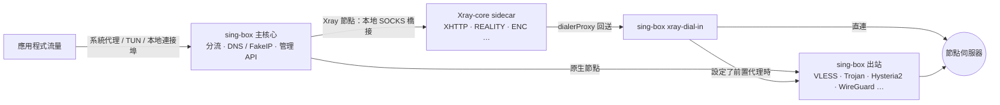

<div align="center">


# FlowZX

以 sing-box 為基礎的跨平台代理用戶端，內建 Xray-core 執行 Xray 獨有的協定組合

[](https://github.com/mutsuki14/FlowZX/releases/latest)
[](https://github.com/mutsuki14/FlowZX/releases)
[](https://github.com/mutsuki14/FlowZX/actions/workflows/ci.yml)
[](https://github.com/SagerNet/sing-box)
[](https://github.com/XTLS/Xray-core)
[](#download)
[](LICENSE.txt)

[简体中文](README.md) · [English](README.en.md) · **繁體中文** · [Русский](README.ru.md) · [فارسی](README.fa.md)

<sub>本文譯自簡體中文版，內容如有出入，請以簡體中文版為準。</sub>

[下載](#download) · [快速開始](#quick-start) · [協定支援](#protocols) · [功能](#features) · [截圖](#screenshots) · [運作原理](#architecture) · [常見問題](#faq) · [回報問題](#feedback) · [建置](#build) · [文件](#docs)

</div>

FlowZX 是跨平台代理用戶端 [FlowZ](https://github.com/dododook/FlowZ) 的分支（fork），以 FlowZ 4.3.3 為基礎，在安裝檔中內建 [Xray-core](https://github.com/XTLS/Xray-core) 26.3.27。sing-box 仍是主核心，負責 TUN / 系統代理、分流、DNS 與管理 API；Xray 以 sidecar 形式只執行 sing-box 不支援的協定組合，例如 VLESS + XHTTP + REALITY + VLESS Encryption。其餘節點照常由 sing-box 執行，行為與 FlowZ 相同。

> [!NOTE]
> 安裝後的應用程式名稱仍是 **FlowZ**：安裝檔名稱為 `FlowZ-<版本>-…`，macOS 上為 `FlowZ.app`。FlowZX 與上游 FlowZ 使用相同的應用程式識別碼、安裝位置與設定目錄，兩者無法並存：已安裝 FlowZ 時，直接覆蓋安裝 FlowZX 即可，節點、訂閱與規則都會保留；反之若以上游安裝檔覆蓋，將失去 Xray 核心。

## 亮點

- **Xray 獨有組合**：XHTTP（auto / packet-up / stream-up / stream-one，支援 `extra`）、VLESS Encryption（`mlkem768x25519plus.*`）、REALITY ML-DSA-65（`pqv`）、`xtls-rprx-vision-udp443`、憑證 SHA-256 釘選（`pcs`），以及任意自訂 Xray outbound JSON。
- **自動選擇核心**：依節點參數判斷是否需要 Xray，需要時自動交由 Xray 執行，並在節點上顯示 **Xray** 標記。Xray 節點同樣支援熱切換、規則指定節點、測速與代理鏈。
- **一次授權**：macOS 的 launchd helper、Windows 的系統服務、Linux 的 systemd helper，安裝一次後，啟停 TUN 就不再反覆要求管理員權限。
- **減少重啟**：切換節點、修改規則的目標節點時經 gRPC 熱切換；僅含網域 / IP / 連接埠 / 處理程序條件的規則，修改符合值後經本地規則集熱重載。
- **組網節點**：WireGuard、Cloudflare WARP（一鍵匿名註冊）、Tailscale（瀏覽器登入，支援 Headscale）可以像一般節點一樣選取與分流。
- **防洩漏與抗封鎖**：FakeIP、TUN 下接管系統 DNS、阻斷 QUIC、WebRTC 防護、TLS Fragment、ECH、Shadow-TLS、Hysteria2 連接埠跳躍。

<a id="download"></a>

## 下載安裝

從 [Releases](https://github.com/mutsuki14/FlowZX/releases/latest) 下載最新版本。下表為 v4.4.2 的直接下載連結：

| 平台 | 檔案 | 說明 |
|---|---|---|
| Windows x64 | [FlowZ-4.4.2-win-x64-setup.exe](https://github.com/mutsuki14/FlowZX/releases/download/v4.4.2/FlowZ-4.4.2-win-x64-setup.exe) | 安裝版，預設僅為目前使用者安裝（安裝時可改為所有使用者），可自選安裝目錄 |
| Windows x64 | [FlowZ-4.4.2-win-x64-portable.exe](https://github.com/mutsuki14/FlowZX/releases/download/v4.4.2/FlowZ-4.4.2-win-x64-portable.exe) | 可攜版，資料儲存在 exe 同目錄下的 `data\` |
| macOS | [FlowZ-4.4.2-mac-arm64.dmg](https://github.com/mutsuki14/FlowZX/releases/download/v4.4.2/FlowZ-4.4.2-mac-arm64.dmg) | Apple 晶片（M 系列） |
| macOS | [FlowZ-4.4.2-mac-x64.dmg](https://github.com/mutsuki14/FlowZX/releases/download/v4.4.2/FlowZ-4.4.2-mac-x64.dmg) | Intel 晶片 |
| Linux x86_64 | [FlowZ-4.4.2-linux-x86_64.AppImage](https://github.com/mutsuki14/FlowZX/releases/download/v4.4.2/FlowZ-4.4.2-linux-x86_64.AppImage) | 免安裝，需要 FUSE 2 |
| Linux x86_64 | [FlowZ-4.4.2-linux-amd64.deb](https://github.com/mutsuki14/FlowZX/releases/download/v4.4.2/FlowZ-4.4.2-linux-amd64.deb) | Debian / Ubuntu，安裝至 `/opt/FlowZ`，建議一併安裝 `policykit-1` |

| 平台 | 系統需求 |
|---|---|
| Windows | Windows 10 / 11，僅 x64 |
| macOS | macOS 12 Monterey 以上，Apple 晶片或 Intel |
| Linux | 僅 x86_64；TUN 需要 polkit（`pkexec`），未安裝提權助手時還需要 `setcap`（`libcap2-bin`）；自動設定系統代理僅支援 GNOME，其他桌面環境請使用 TUN 或「僅本地」 |

### 首次執行

- **macOS**：應用程式沒有 Apple 開發者簽署，第一次開啟時會提示「已損毀，無法打開」。將 FlowZ 拖入「應用程式」後，在終端機執行一次下面的指令，再正常開啟即可。遇到這個提示時，「右鍵 → 打開」無效。DMG 中的 `0 首次打开必读 READ ME FIRST.txt` 也有相同說明。

  ```bash
  xattr -cr /Applications/FlowZ.app
  ```

- **Windows**：安裝檔未簽署，SmartScreen 可能提示「Windows 已保護您的電腦」，請按「其他資訊」→「仍要執行」。
- **Linux**：AppImage 需先執行 `chmod +x`，並需要 FUSE 2（如 `libfuse2`，Ubuntu 24.04 為 `libfuse2t64`）。Ubuntu 24.04 以上建議使用 `.deb`，其安裝指令碼會寫入 AppArmor 設定檔。

### 解除安裝與更新

- Windows 安裝版在解除安裝時會刪除 `%APPDATA%\flowz`（節點、訂閱、規則等全部設定）與提權服務。若需保留，請先在「設定 → 進階 → 資料備份與還原」匯出備份。覆蓋升級不會刪除資料。

> [!IMPORTANT]
> 自 4.4.1 起，「關於」頁與系統匣選單中的「檢查更新」、啟動時的自動檢查，以及「關於」頁的儲存庫連結與「回報問題」都指向本儲存庫。4.4.0 的這些入口仍指向上游 [dododook/FlowZ](https://github.com/dododook/FlowZ)：請從本儲存庫的 [Releases](https://github.com/mutsuki14/FlowZX/releases) 手動安裝一次 4.4.1 或更新版本，之後即可在應用程式內更新。上游安裝檔不含 Xray 核心，請勿以其覆蓋安裝 FlowZX。

<a id="quick-start"></a>

## 快速開始

1. **新增節點**：在「節點」頁點選「新增訂閱」並貼上訂閱連結；或點選「手動匯入」，從檔案或貼上的文字匯入分享連結、Clash、sing-box、Xray 設定；也可以逐一手動新增。
2. **選擇節點**：在「主頁」或「節點」頁選取要使用的節點。
3. **確認接管方式與分流策略**：新安裝預設為「系統代理」+「全域」。
   - 「智慧分流」：國內直連、國外走代理。自訂規則與應用分流只在此模式下生效。
   - 「TUN 網卡」：接管所有應用程式的流量與系統 DNS。macOS / Windows 首次啟用時會提示安裝提權助手；Linux 首次啟用時經 pkexec 授權一次，也可在「設定 → 網路 → 提權助手」安裝 systemd 助手，之後不再要求授權。
   - 「僅本地」：只開放本地連接埠（預設 `7890`，HTTP 與 SOCKS 共用），不變更系統代理與網卡。
4. **開啟代理**：在「主頁」點選「開啟代理」。
5. **（選用）設定規則**：在「規則」頁新增自訂規則；在「應用分流」頁依應用程式指定代理 / 直連 / 阻斷（總開關預設關閉）。

<a id="protocols"></a>

## 協定支援

節點預設由 sing-box 執行，只有用到 Xray 獨有特性的節點才交給 Xray。參數與實作細節請見 [docs/XRAY.md](docs/XRAY.md)。

| 協定 / 組合 | sing-box | Xray |
|---|:---:|:---:|
| **VLESS + XHTTP + REALITY + VLESS Encryption** | — | ✅ 自動 |
| VLESS / VMess / Trojan + XHTTP | — | ✅ 自動 |
| VLESS Encryption（`mlkem768x25519plus.*`，HTTP/2 以外的傳輸） | — | ✅ 自動 |
| `xtls-rprx-vision-udp443` 流控 | — | ✅ 自動 |
| REALITY ML-DSA-65 驗證（`pqv`，限 TCP / gRPC / XHTTP 傳輸） | — | ✅ 自動 |
| TLS + 憑證 SHA-256 釘選（`pcs`） | — | ✅ 自動 |
| VLESS / VMess / Trojan（TCP / WebSocket / gRPC / HTTPUpgrade + TLS；VLESS 與 Trojan 另支援 REALITY，VLESS 另支援 `xtls-rprx-vision`） | ✅ 預設 | 可手動切換（WebSocket / HTTPUpgrade 上的 REALITY 除外） |
| VLESS / VMess / Trojan + HTTP/2 傳輸 | ✅ | — |
| Shadowsocks / SS2022（可附加外掛或 Shadow-TLS v3） | ✅ 預設 | 可手動切換（僅限 AEAD / 2022 加密方法，且未使用外掛或 Shadow-TLS）；匯入的 XHTTP 等組合自動 |
| Hysteria2（連接埠跳躍，salamander / gecko 混淆）、TUIC、AnyTLS、Snell v4 / v6 | ✅ | — |
| NaiveProxy（Cronet，可選 HTTP/3） | ✅ | — |
| SOCKS5、HTTP(S)、SSH | ✅ | — |
| WireGuard、Cloudflare WARP、Tailscale（組網節點） | ✅ | — |
| 自訂出站 JSON | ✅ sing-box outbound | ✅ Xray outbound（如 mKCP + finalmask、hysteria、wireguard） |

**✅ 自動**：用到該特性時自動改由 Xray 執行，節點卡片會顯示 **Xray** 標記，將滑鼠移到標記上可查看原因。**✅ 預設 / 可手動切換**：預設由 sing-box 執行，可在節點編輯表單的「進階」中開啟「使用 Xray 核心」，改由 Xray 執行。**—**：不由該核心執行。

### 匯入來源

| 格式 | 訂閱 | 手動匯入 |
|---|:---:|:---:|
| 分享連結：`vless`、`vmess`、`trojan`、`hysteria2` / `hy2`、`ss`、`tuic`、`anytls`、`snell`、`naive+https`、`socks5`、`http(s)` 等，可為 Base64 清單 | ✅ | ✅ |
| Clash / mihomo YAML 或 JSON（含 `xhttp-opts`、`proxy-providers`） | ✅ | ✅ |
| sing-box JSON（`outbounds`） | ✅ | ✅ |
| Xray JSON：單份設定、設定陣列（Marzban / 3x-ui 等面板的「v2ray-json」訂閱）、純 outbound 陣列 | ✅ | ✅ |

匯入 Xray JSON 時，表單能表達的節點會轉為一般節點，其餘（如 mKCP、TCP 的 HTTP 偽裝標頭、finalmask、mux、自訂 sockopt）則以「自訂 Xray 出站 JSON」原樣匯入；`freedom` / `direct`、`blackhole` / `block`、`dns`、`loopback` 等內部出站會被略過。設定陣列中的節點以各份設定的 `remarks` 命名（一份設定含多個代理出站時為「remarks · tag」）；沒有 `remarks` 時以 `位址:連接埠` 命名（自訂 Xray 出站 JSON 節點前加協定名稱），仍重名時再附加設定序號（如 `example.com:443 #2`）。代理鏈（`dialerProxy` / `proxySettings`）會轉為節點的「前置代理」，只在同一份設定內解析。詳見 [docs/XRAY.md](docs/XRAY.md)。

<a id="features"></a>

## 功能

### 接管與分流

- 接管方式：系統代理 / TUN 網卡 / 僅本地
- 分流策略：全域 / 智慧分流 / 直連；地區分流（中國 / 伊朗 / 俄羅斯，可反向）
- 本地混合連接埠可開放給區域網路
- 一鍵複製終端機代理指令（CMD / PowerShell / Bash / git）

### 節點切換

- gRPC 熱切換，失敗時改為重啟核心；預設在切換時中斷舊節點上的連線（可關閉）
- 編輯未使用的節點時預設進入「待套用」，一鍵生效
- 可選用的節點故障自動切換：每 30 秒探測一次，連續 3 次失敗後切換
- 代理鏈（前置代理），自動排除迴圈

### 規則

- 15 類條件（網域、IP/CIDR、連接埠、處理程序、來源 MAC / 主機名稱、geosite、geoip、規則集等），可用 OR / AND 組合
- 動作為代理 / 直連 / 阻斷，可指定目標節點
- 規則資源：內建 MetaCubeX 規則目錄，可新增 `https://….srs` 遠端規則集，預設每 12 小時自動更新
- 應用分流：依處理程序指定代理 / 直連 / 阻斷（實驗性）

### DNS 與防洩漏

- 國內 / 國外 DoH 分開設定（預設 `doh.pub` / `dns.google`）
- FakeIP（新安裝預設開啟）；TUN 下接管系統 DNS
- 節點網域多上游競速解析；攔截瀏覽器 DoH
- 阻斷 QUIC（新安裝預設開啟）；WebRTC 防護（僅 TUN）

### 抗封鎖

- TLS Fragment：全域開關，也作用於 Xray 節點，不作用於 Hysteria2 / TUIC / NaiveProxy
- ECH、uTLS 指紋、Shadow-TLS v3、Multiplex（smux / yamux / h2mux）
- 依平台可選的 TLS 引擎（Go / Schannel / Network.framework）
- TLS spoof（需提權，ARM64 無法使用）

### 組網

- WireGuard：預設以使用者態網路堆疊執行，支援 reserved、MTU
- Cloudflare WARP：一鍵匿名註冊，刪除節點時註銷裝置
- Tailscale：瀏覽器登入或 authKey、自訂控制伺服器（Headscale）、出口節點、子網路由、Tailscale SSH
- 反向 mesh（需 TUN 與提權助手）

### 訂閱

- 預設每 12 小時自動更新（可設為 1–168 小時），失敗後指數退避
- 更新預設不中斷目前的連線（變更了正在使用的節點時除外，見[常見問題](#faq)）
- 可選擇經代理更新；顯示流量與到期時間
- GitHub 下載可走 gh-proxy 鏡像（預設關閉）

### 診斷

- 延遲測速：TTFB，預設請求 `generate_204`，位址可自訂；不測頻寬
- 串流媒體 / AI 服務解鎖偵測（ChatGPT、Claude、Gemini、Netflix、Disney+、Spotify）
- 連線清單與即時記錄
- 匯出脫敏診斷報告（含 Xray 狀態）

### 管理

- sing-box 原生 gRPC 管理 API
- 隨附的官方 sing-box 面板（新安裝預設開啟，代理執行時可用）
- sing-box 核心線上更新：sha256 校驗、啟動預檢、失敗自動回復
- 資料備份與還原（6 類可選）；應用程式內完整解除安裝

### 介面

- 简体中文 / 繁體中文 / English / Русский / فارسی（波斯語為由右至左版面），可跟隨系統
- 淺色 / 深色 / 跟隨系統
- 隱私模式（密碼鎖）；可選在閒置時自動進入輕量 / 隱私模式
- macOS 選單列常駐；開機自動啟動、靜默啟動、自動連線

<a id="screenshots"></a>

## 截圖

截圖取自 FlowZX 目前的介面，使用示範資料（非真實訂閱 / 節點）。「節點」頁中帶有 **Xray** 標記的節點由 Xray 核心執行（XHTTP、VLESS Encryption、自訂 Xray 出站 JSON），其餘由 sing-box 執行；「設定」截圖展示「進階 → 核心管理」中的 Xray 核心（sidecar）狀態。

| 淺色 | 深色 |
|:---:|:---:|
|  |  |

<details>
<summary>更多截圖：節點、應用分流、規則、規則資源、連線、記錄、設定</summary>

| 節點 | 應用分流 |
|:---:|:---:|
|  |  |

| 規則 | 規則資源 |
|:---:|:---:|
|  |  |

| 連線 | 記錄 |
|:---:|:---:|
|  |  |

| 設定 |
|:---:|
|  |

</details>

<a id="architecture"></a>

## 運作原理



- sing-box 是唯一的主核心。Xray 節點在 sing-box 中只是一個本地 SOCKS 出站，因此熱切換、規則指定節點、測速與出口 IP 偵測，都與原生節點走同一套邏輯。
- Xray 以一般使用者權限執行，只監聽 `127.0.0.1`。啟動前以 `xray run -test` 驗證設定，隨主核心一起啟停；意外結束後 60 秒內最多自動重啟 3 次，超過後即停止並提示，sing-box 不受影響。
- Xray 發出的連線經 `dialerProxy` 回到 sing-box，由 sing-box 直連或交給前置節點（可以是原生節點，也可以是另一個 Xray 節點）。前置節點無法使用時，連線會被拒絕，不會改為直連。阻斷 QUIC、TLS Fragment 等路由層設定對 Xray 節點同樣有效。

<a id="faq"></a>

## 常見問題與已知限制

### 如何得知節點由哪個核心執行？

帶有 **Xray** 標記的節點由 Xray 執行，將滑鼠移到標記上可查看原因（如「XHTTP 傳輸」「憑證 SHA-256 指紋」）。Xray 的版本與執行狀態可在「設定 → 進階 → 核心管理 → Xray 核心（sidecar）」中查看。

### 為什麼一般的 VLESS / Trojan 節點也顯示 Xray 標記？

填寫了「憑證 SHA-256 指紋」（`pcs`）的 TLS 節點會自動改由 Xray 執行，因為 sing-box 不支援整張憑證的釘選。

### 如何更換 Xray 版本？

Xray 沒有線上更新。將 `xray`（Windows 為 `xray.exe`）放到 `<userData>/xray_core/` 目錄，存在時會優先於隨附版本；實際路徑會顯示在核心管理的 Xray 那一列。macOS / Linux 需先對該檔案執行 `chmod +x`，否則會被忽略並繼續使用隨附版本。

### 變更設定後連線短暫中斷？

sing-box 無法在執行中增刪出站，部分修改需要重啟核心。重啟有 1.5 秒的防抖，連續修改會合併為一次，通常幾秒內就會恢復，Windows TUN 下稍慢。

| 修改 | 結果 |
|---|---|
| 切換選取的節點；修改規則的目標節點 | 熱切換，不重啟（目標節點處於「待套用」，或為僅在選取時才路由內網網段的組網節點時，會重啟） |
| 修改已啟用規則的符合值（規則僅含網域、IP/CIDR、連接埠、處理程序類條件） | 本地規則集熱重載，不重啟 |
| 修改含 geosite、geoip、規則集或來源裝置條件的規則 | 重啟 |
| 新增、刪除、排序規則，修改規則動作 | 重啟 |
| 切換分流策略，修改本地連接埠或 TUN 設定 | 重啟 |
| 編輯或刪除正在使用的節點（選取的節點、規則目標、前置代理鏈中的節點、組網節點）；訂閱更新變更或下架了這些節點 | 重啟 |
| 新增、刪除、修改未使用的節點（含訂閱更新帶來的此類變化） | 進入「待套用」，不重啟（可在設定中改為立即重啟） |

在「全域」或「直連」模式下修改規則不會重啟，因為規則只在「智慧分流」下生效。

### 系統代理模式下，DNS、QUIC、WebRTC 會繞過代理嗎？

會。系統代理只對遵循代理設定的應用程式生效，DNS 接管與 WebRTC 防護只在 TUN 模式下運作。需要完整接管時請使用 TUN。阻斷 QUIC 拒絕的是送往代理的 UDP 443，讓瀏覽器退回 TCP；以 QUIC 撥號的節點（Hysteria2 / TUIC / NaiveProxy）本身不受影響。

<details>
<summary>完整的已知限制</summary>

**通用**

- Tailscale：每台裝置只能新增一個 Tailscale 節點，所有帳號共用 `100.64.0.0/10` 網段。
- NaiveProxy：Linux / Windows 需要隨附的 `libcronet`，缺少時 naive 節點會被略過，若選取的正是 naive 節點則會提示；macOS 的 sing-box 已靜態編入 Cronet。
- `hy2://` 分享連結不攜帶連接埠跳躍參數；需要時請在表單中填寫，或透過 sing-box JSON、Clash `ports` 匯入。
- Multiplex 不作用於使用 `vision` 流控的節點。
- WireGuard / Tailscale 組網節點不能作為前置代理。
- 規則資源的遠端匯入只接受以 `https://` 開頭的 `.srs` 檔案。

**Xray 節點**

- Xray 26 移除了 `allowInsecure`，Xray 節點上的「允許不安全連線」不會生效。自簽憑證請填寫「憑證 SHA-256 指紋」，可用 `xray tls hash --cert cert.pem` 取得。
- 開啟 ECH 時必須提供 ECHConfigList 或 DNS 查詢位址，否則節點無效。
- 使用 HTTP/2 傳輸、Shadow-TLS 或 SS 外掛的節點不能改用 Xray。
- 使用串流加密（如 `aes-*-cfb`、`aes-*-ctr`、`rc4-md5`、`chacha20-ietf`）的 Shadowsocks 節點不能改用 Xray：Xray 僅支援 AEAD 與 2022 加密方法。
- Xray 的 REALITY 僅支援 TCP（RAW）/ gRPC / XHTTP 傳輸：WebSocket / HTTPUpgrade 上的 REALITY 節點只能由 sing-box 執行。ML-DSA-65 驗證（`pqv`）同樣只能用於這三種傳輸，表單在其他傳輸上不顯示該欄位。
- 不使用 sing-box 的 Multiplex；XHTTP 的連線多工請在 `extra.xmux` 中設定。
- 自訂 Xray JSON 中的 `tag`、`proxySettings`、`sockopt.dialerProxy` 由 FlowZX 接管，代理鏈請使用節點的「前置代理」。
- 隨附的 Xray 缺失時，Xray 節點會被略過；若選取的正是 Xray 節點則會提示。

**Xray JSON 匯入**

- 代理鏈的前置指向內部出站（如 3x-ui 的 `fragment` 分片 freedom）時，該鏈不會保留並發出警告：節點直連伺服器，分片設定不生效。訂閱更新時警告記在「記錄」頁，手動匯入時在「手動匯入」對話方塊中提示。
- `direct` / `block`（`freedom` / `blackhole` 的協定別名）等內部出站會被略過，不會匯入為節點。
- TCP（RAW）帶 HTTP 偽裝標頭的出站以「自訂 Xray 出站 JSON」原樣匯入，由 Xray 執行，只能編輯其 JSON。

</details>

<a id="feedback"></a>

## 回報問題

請在本儲存庫的 [Issues](https://github.com/mutsuki14/FlowZX/issues) 回報。應用程式內「關於」頁的「回報問題」會開啟本儲存庫的新增 issue 頁面，並預先填入應用程式版本、系統與架構、sing-box 版本與接管方式（自 4.4.1 起）；自 4.4.2 起還會預先填入 Xray 版本與執行狀態、目前選取的節點由哪個核心執行及原因（含前置代理是否經過 Xray）與分流策略。預先填入的內容不含節點位址、節點名稱或憑證。請另外附上：

- 問題描述、重現步驟，以及錯誤前後的記錄（Xray 核心的記錄以 `[xray]` 開頭）。「記錄」頁的即時記錄未脫敏，貼上前請遮蔽節點位址、節點名稱與網域
- 出問題的節點不是目前選取的節點時：它是否帶有 Xray 標記，以及標記顯示的原因
- 「記錄」頁匯出的脫敏診斷報告：報告會隱去金鑰、節點位址與節點名稱，但記錄明細仍可能含有造訪過的其他網域 / IP、訂閱伺服器網域以及本機檔案路徑（可能含系統使用者名稱），上傳前請檢查，介意可先刪除

未透過「回報問題」提交（例如應用程式無法啟動）時，請依 issue 範本手動填寫版本、系統、核心版本與狀態、目前節點核心、接管方式與分流策略。

如果問題在不帶 Xray 標記的節點上同樣出現，它也可能存在於上游 FlowZ。

<a id="build"></a>

## 從原始碼建置

需要 Node.js 26（與 CI 一致）、Go 1.24 以上（用於編譯提權助手；缺少時會略過，打包出的安裝檔不含提權助手）、`bash`、`curl`、`tar`、`unzip`（Windows 請在 Git Bash 等提供這些指令的環境中執行），並且能存取 GitHub 與 `proxy.golang.org`。

```bash
git clone https://github.com/mutsuki14/FlowZX.git
cd FlowZX
npm ci                 # .npmrc 預設使用 npmmirror 鏡像
npm run fetch:core     # 下載 sing-box 與 Xray 並校驗 sha256；二進位檔不納入儲存庫，開發模式同樣需要
npm run dev            # Vite + Electron 開發模式
```

| 指令 | 作用 |
|---|---|
| `npm run build` | 編譯主處理程序與渲染處理程序 |
| `npm run package:win` | Windows 安裝版與可攜版 |
| `npm run package:mac` | macOS arm64 與 x64 的 `FlowZ.app`（DMG 只在 CI 中產生） |
| `npm run package:linux` | Linux AppImage 與 deb |
| `npm test` | 單元測試 |
| `npm run lint` | ESLint 檢查 |
| `npm run test:core-gate` | 以隨附的 sing-box / Xray 驗證產生的設定 |
| `npm run test:xray-e2e` | Xray 端對端測試（僅 Linux / macOS，需先執行 `fetch:core`） |

- `package:*` 依序執行 `build:helper` → `fetch:core` → `test:core-gate` → `fetch:cronet`（僅 Windows / Linux）→ `fetch:dashboard` → `build` → electron-builder，產出位於 `dist-package/`。各平台請在對應的作業系統上打包。
- NaiveProxy 所需的 `libcronet` 由 `fetch:cronet` 從 Go 模組代理下載；macOS 的 sing-box 已靜態編入 Cronet，無需下載。
- 發布：推送 `v*` tag，或在 `main` 分支上手動執行 Release 工作流程；發行說明取自 `docs/releases/v<版本>.md`。

技術堆疊：Electron 42 · React 19 · TypeScript · Vite · Tailwind CSS · Radix UI · electron-builder；核心為 sing-box 與 Xray-core（版本見頂部徽章與 [`src/shared/core-manifest.json`](src/shared/core-manifest.json)）；提權元件以 Go 撰寫（macOS launchd helper、Windows 服務、Linux systemd helper）。

<a id="docs"></a>

## 文件

| 文件 | 內容 |
|---|---|
| [docs/XRAY.md](docs/XRAY.md) | Xray 核心：支援的組合、架構、匯入參數、注意事項、驗證方法 |
| [docs/releases/v4.4.2.md](docs/releases/v4.4.2.md) | v4.4.2 發行說明 |
| [docs/releases/v4.4.1.md](docs/releases/v4.4.1.md) | v4.4.1 發行說明 |
| [docs/releases/v4.4.0.md](docs/releases/v4.4.0.md) | v4.4.0 發行說明 |
| [docs/RELEASE.md](docs/RELEASE.md) | 發布流程 |
| [resources/README.md](resources/README.md) | 隨附資源與核心檔案 |
| [resources/data/README.md](resources/data/README.md) | 內建規則集 |
| [helper/README.md](helper/README.md) | macOS 提權 helper |

<a id="credits"></a>

## 致謝

| 專案 | 用途 |
|---|---|
| [FlowZ](https://github.com/dododook/FlowZ)（原作者開源儲存庫：[zhangjh/FlowZ](https://github.com/zhangjh/FlowZ)） | FlowZX 的上游 |
| [sing-box](https://github.com/SagerNet/sing-box) | 主核心 |
| [Xray-core](https://github.com/XTLS/Xray-core) | sidecar 核心 |
| [cronet-go](https://github.com/SagerNet/cronet-go) | NaiveProxy 使用的 Cronet |
| [sing-box-dashboard](https://github.com/SagerNet/sing-box-dashboard) | 隨附的官方面板 |
| [sing-geoip](https://github.com/SagerNet/sing-geoip) · [sing-geosite](https://github.com/SagerNet/sing-geosite) · [meta-rules-dat](https://github.com/MetaCubeX/meta-rules-dat) | 內建與可下載的規則集 |
| [IBM Plex](https://github.com/IBM/plex) · [Space Grotesk](https://github.com/floriankarsten/space-grotesk) · [country-flag-icons](https://gitlab.com/catamphetamine/country-flag-icons) | 介面字型與國旗圖示 |

<a id="license"></a>

## 授權與免責聲明

- FlowZX 原始碼以 [MIT](LICENSE.txt) 授權條款發布（Copyright (c) 2025 FlowZ Project）。
- 隨附散布的第三方程式遵循各自的授權條款：sing-box 為 GPL-3.0-or-later，Xray-core 為 MPL-2.0，其他元件以各自上游的聲明為準。
- 本軟體僅供學習與研究使用。請遵守當地法律法規，使用本軟體所產生的一切後果由使用者自行承擔。
